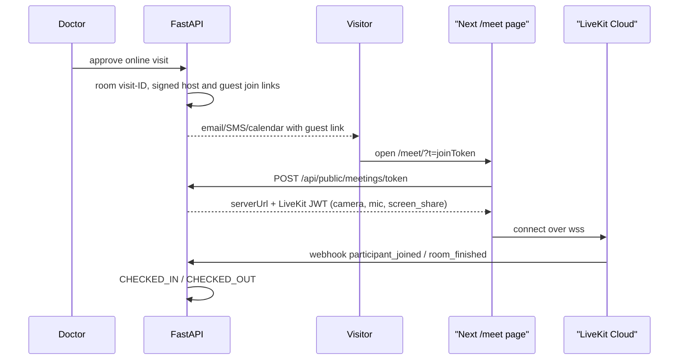

# LiveKit online consultations — architecture

LiveKit Cloud replaces Zoom for online appointments. Consultations run in an in-app, Conninter-styled room at `/meet`.

## Flow

## Backend (`python_backend/`)

| Piece | File |
| :-- | :-- |
| Room, join links, join window, participant token | `app/services/livekit_service.py` |
| Token endpoint (public) | `app/routers/meetings.py` → `POST /api/public/meetings/token` |
| Webhook verify + lifecycle | `app/services/livekit_webhook_service.py`, `app/routers/livekit_webhooks.py` → `POST /api/webhooks/livekit` |
| Approval hook | `StaffService.approve_visit` → `LiveKitService.assign_meeting` |
| Migration | `scripts/migrate_livekit_meetings.py` (adds `meetingProvider`, `meetingRoomName`, `meetingJoinUrl`, `meetingHostUrl`) |
| E2E fixture | `scripts/e2e_meeting_fixture.py` (`create`, `status`, `webhook`, `cleanup`) |

- **Join links** are HS256 JWTs signed with `JWT_SECRET`: `{typ: "meeting_join", vid, role: host|guest, exp}`. The link format is `{PUBLIC_FRONTEND_URL}/meet/?t=...`.
- **Join window** runs from `appointmentDate − MEETING_JOIN_EARLY_MINUTES` (15) until `appointmentDate + allottedMinutes (30) + MEETING_JOIN_GRACE_MINUTES` (60). All times are naive IST.
- **Token errors:**
  - 403: bad, expired or foreign link, or a visit that isn't joinable
  - 404: not an online visit
  - 425: too early; the body includes `opensAt` and `closesAt`
  - 503: `LIVEKIT_*` not configured
- **Participant grants:**
  - `roomJoin`, publish, subscribe and data
  - sources: `camera`, `microphone`, `screen_share`, `screen_share_audio`
  - the host is `roomAdmin`
  - TTL is 2 hours
  - identity is `doctor-{staffId}` or `visitor-{visitorId}`
- **Webhook:**
  - `participant_joined` moves APPROVED to CHECKED_IN, with `checkedInLocation=LIVEKIT_ONLINE`.
  - `room_finished` moves the visit to CHECKED_OUT and records the duration.
  - Both are idempotent.
  - Database work runs in a threadpool. Notifications go out on a detached thread after the response, because email and SMS can outlast LiveKit's webhook timeout.
- **Legacy data:** `meeting_join_url()` / `meeting_host_url()` fall back to `zoomJoinUrl` / `zoomStartUrl` for visits approved before the switch.

## Frontend (`frontend/`)

- Route `src/app/meet/page.tsx` (static-export safe, `useSearchParams` inside `Suspense`) → `src/features/meetings/MeetingRoom.tsx`.
- **States:**
  - loading
  - too early, with a countdown that opens the room automatically
  - invalid or expired link
  - not configured
  - network error
  - pre-join (`PreJoin`: camera/mic preview and device pickers)
  - in call
  - reconnecting (`ConnectionStateToast`)
  - left, with a rejoin button
- **In call:**
  - A chat-free copy of LiveKit's `VideoConference`: `GridLayout`, and `FocusLayout` that auto-pins screenshare.
  - `ControlBar` with mic, camera, screenshare, device menus and leave.
  - `RoomAudioRenderer`.
  - Navy skin in `meetingRoom.css`.
- **Test hook:** `window.__lkRoom` is exposed when `NEXT_PUBLIC_E2E_HOOKS=true` or when the URL has `?e2e=1`.
- **Callers:**
  - the booking status page (`meetingJoinUrl`)
  - My Visitors "Start consultation" (`meetingHostUrl`)
  - the security Today tab (reference link)

## Config

Server-only env vars: `LIVEKIT_URL=wss://conninter-25n5j1f3.livekit.cloud`, `LIVEKIT_API_KEY`, `LIVEKIT_API_SECRET`. The frontend needs no LiveKit secrets.
