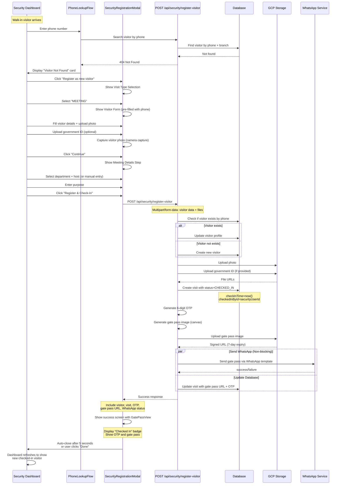

# Security-Assisted Visitor Registration - Feature Architecture

## 1. Overview

### Problem Statement
Security personnel need to register walk-in visitors who have not pre-registered via the public kiosk flow. These visitors arrive unannounced and must be quickly processed for entry. Security personnel verify the visitor's identity in person (via photo and ID check) and complete registration on their behalf.

### Goals
1. **Streamlined Walk-in Processing**: Enable security personnel to register visitors efficiently without requiring visitors to use the self-service kiosk.
2. **Reuse Existing Infrastructure**: Maximize reuse of existing visitor registration components and services.
3. **Direct Check-in Flow**: Skip the approval workflow for security-initiated registrations since identity is verified in person.
4. **WhatsApp Delivery**: Deliver gate pass to visitor's phone (non-blocking, proceed even if delivery fails).
5. **Profile Reuse**: Automatically reuse existing visitor profiles when a phone number is recognized.

### Out of Scope
1. **Self-service registration**: This is handled by the existing public flow.
2. **Visitor verification via OTP**: Security verifies identity in person (photo/ID check).
3. **Host notifications**: Host notifications are handled after approval in the standard flow (not applicable for direct check-in).
4. **Visit modification after registration**: Only standard check-out workflow.

---

## 2. Component Reuse Matrix

| Component | Location | Reuse Strategy | Modifications Required |
|-----------|-----------|----------------|---------------------|
| `MeetingRegistrationForm` | `frontend/src/components/visitors/public/MeetingRegistrationForm.tsx` | **With Modifications** | - Adjust step indicator text for modal context<br>- Optionally hide "Step X of 6" indicator<br>- The component already supports: `isExistingVisitor`, `existingVisitorData`, `initialFormData` props |
| `DeliveryRegistrationForm` | `frontend/src/components/visitors/steps/DeliveryRegistrationForm.tsx` | **With Modifications** | - Adjust step indicator text for modal context<br>- Optionally hide "Step X of 6" indicator<br>- The component already supports: `initialFormData` prop |
| `MeetingDetailsStep` | `frontend/src/components/visitors/steps/MeetingDetailsStep.tsx` | **As-Is** | No modifications needed. Already supports department staff lookup and manual entry modes. |
| `DeliveryDetailsStep` | `frontend/src/components/visitors/steps/DeliveryDetailsStep.tsx` | **As-Is** | No modifications needed. |
| `PhoneLookupFlow` | `frontend/src/app/security/dashboard/components/PhoneLookupFlow.tsx` | **With Modifications** | - Wire `onRegisterNew` callback to open modal<br>- Pass `phone` and `branchId` to modal |
| `GatePassView` | `frontend/src/components/visitors/shared/GatePassView.tsx` | **With Modifications** | - Add `checkedIn` prop to display "Checked In" badge instead of "Approved"<br>- Remove validity warning for security-initiated check-ins |
| `GatePassService` | `backend/src/visitors/services/gate-pass.service.ts` | **As-Is** | No modifications needed. Existing methods: `generateCheckInOtp`, `generateGatePassImage`, `uploadGatePassToGcp`, `sendGatePassViaWhatsApp`. |
| `SecurityService.approveVisit()` | `backend/src/security/security.service.ts` | **Reference Only** | Do NOT reuse directly. This method transitions to APPROVED → requires separate check-in. We need direct CHECKED_IN. |
| `VisitorsService` | `backend/src/visitors/visitors.service.ts` | **As-Is** | No modifications needed. Methods `publicRegisterVisitor`, `registerPublicVisitor`, `updateVisitor` are already available. |

---

## 3. Backend API Design

### New Endpoint
```
POST /api/security/register-visitor
```

### Request DTO

```typescript
// Base visitor registration fields (common to both types)
interface BaseSecurityRegistrationDto {
  phone: string; // Verified phone number from PhoneLookupFlow
  branchId: string; // From authenticated security user
  firstName: string;
  lastName: string;
  email?: string; // Required for MEETING visits
  company?: string;
  designation?: string; // Required for MEETING visits
  address?: string;
}

// Meeting visit variant
interface SecurityMeetingRegistrationDto extends BaseSecurityRegistrationDto {
  visitType: 'MEETING';
  department: Department;
  hostSelectionMode: 'dropdown' | 'manual';
  hostId?: string; // If dropdown mode
  staffName?: string; // If manual mode
  staffPhone?: string; // If manual mode
  purpose: string;
}

// Delivery visit variant
interface SecurityDeliveryRegistrationDto extends BaseSecurityRegistrationDto {
  visitType: 'DELIVERY';
  deliveryPlatform: string;
  deliveryRecipient: string;
  orderReference?: string;
}

// Union type
type SecurityRegistrationDto =
  | SecurityMeetingRegistrationDto
  | SecurityDeliveryRegistrationDto;
```

### Response DTO

```typescript
interface SecurityRegistrationResponse {
  success: boolean;
  message: string;
  visitor: {
    id: string;
    firstName: string;
    lastName: string;
    phone: string;
    email?: string;
    company?: string;
    photo?: string;
  };
  visit: {
    id: string;
    visitType: 'MEETING' | 'DELIVERY';
    status: 'CHECKED_IN'; // Always CHECKED_IN for security-initiated
    checkInTime: string;
    checkInOtp: string;
    checkInOtpExpiry: string;
    gatePassUrl: string;
    gatePassUrlExpiry: string;
    department?: string;
    hostName?: string;
    hostPhone?: string;
    purpose?: string;
    deliveryPlatform?: string;
    deliveryRecipient?: string;
  };
  whatsappSent: boolean;
}
```

### Error Handling Codes

| Error Code | HTTP Status | Description |
|------------|-------------|-------------|
| `VISITOR_ALREADY_EXISTS` | 409 | Visitor profile already exists (should auto-reuse) |
| `INVALID_PHONE_FORMAT` | 400 | Phone number format is invalid |
| `EMAIL_REQUIRED_FOR_MEETING` | 400 | Email is required for meeting visits |
| `DEPARTMENT_REQUIRED` | 400 | Department is required for meeting visits |
| `HOST_REQUIRED` | 400 | Either hostId or staffName/staffPhone must be provided |
| `FILE_UPLOAD_ERROR` | 400 | File upload failed (size, type, or network) |
| `GCP_UPLOAD_FAILED` | 500 | Failed to upload gate pass to GCP |
| `WHATSAPP_SEND_FAILED` | 200 (success) | WhatsApp delivery failed but registration succeeded (warning) |

### Authorization Requirements

```typescript
// Only SECURITY and SECURITY_SUPERVISOR roles can access this endpoint
requiredRoles: [Role.SECURITY, Role.SECURITY_SUPERVISOR];

// Must match user's branchId
branchId === user.branchId;
```

---

## 4. Backend Service Design

### New Service: `SecurityRegistrationService`

**Location**: `backend/src/security/security-registration.service.ts`

```typescript
@Injectable()
export class SecurityRegistrationService {
  constructor(
    private readonly prisma: DatabaseService,
    private readonly visitorsService: VisitorsService,
    private readonly gatePassService: GatePassService,
    private readonly gcpStorageService: GcpStorageService,
    private readonly configService: ConfigService,
  ) {}

  /**
   * Orchestrates security-assisted visitor registration.
   * Handles both Meeting and Delivery visit types.
   * Directly creates visit in CHECKED_IN status.
   * Generates gate pass and delivers via WhatsApp (non-blocking).
   */
  async registerVisitor(
    dto: SecurityRegistrationDto,
    files: VisitorFiles,
    user: JwtPayload,
  ): Promise<SecurityRegistrationResponse> {
    // Implementation details in section 7
  }
}
```

### Method: `registerVisitor()`

**Orchestration Flow**:

1. **Authorization Check**: Validate user role and branch access
2. **Phone Validation**: Validate phone format (10 digits)
3. **Visitor Lookup**: Check if visitor exists by phone + branch
   - If exists: reuse profile, update fields if needed
   - If not exists: create new visitor
4. **File Upload**: Upload photo and documents to GCP
5. **Create Visit**: Create visit record with status = `CHECKED_IN`
   - Set `checkInTime` = `now()`
   - Set `checkedInById` = `user.id`
6. **Generate Check-In OTP**: Use `GatePassService.generateCheckInOtp()`
7. **Generate Gate Pass Image**: Use `GatePassService.generateGatePassImage()`
8. **Upload Gate Pass to GCP**: Use `GatePassService.uploadGatePassToGcp()`
9. **Send WhatsApp**: Use `GatePassService.sendGatePassViaWhatsApp()` (non-blocking)
10. **Return Response**: Include visitor, visit, OTP, gate pass URL, WhatsApp status

### Transaction Handling

```typescript
// Use Prisma transaction for atomic visitor+visit creation
await this.prisma.$transaction(async (tx) => {
  // Step 1: Create or update visitor
  const visitor = await tx.visitor.upsert({...});

  // Step 2: Create visit with CHECKED_IN status
  const visit = await tx.visit.create({
    data: {
      visitorId: visitor.id,
      status: VisitStatus.CHECKED_IN,
      checkInTime: new Date(),
      checkedInById: user.id,
      // ... other fields
    },
  });

  return { visitor, visit };
});
```

### Audit Trail Approach

All database records include:
- `createdAt` and `updatedAt` timestamps (automatic)
- `checkedInById` field identifies which security user performed check-in
- `checkInTime` field records when check-in occurred

No separate audit log table is required for this feature.

---

## 5. Database Considerations

### Schema Changes Required

**NONE**. The existing Prisma schema has all required fields:

- `Visitor.phoneVerified`: Can be set to `true` for security-initiated registrations
- `Visit.checkedInById`: Links to security user who performed check-in
- `Visit.checkInTime`: Timestamp of check-in
- `Visit.status`: Can be set to `CHECKED_IN` directly
- `Visit.checkInOtp`, `Visit.checkInOtpExpiry`: For gate pass generation
- `Visit.gatePassUrlExpiry`: For gate pass URL expiration
- `Visit.gatePassSentViaWhatsApp`: For tracking delivery status

### Tracking Security-Initiated Registrations

Use `checkedInById` field to identify security-initiated check-ins:

```typescript
// Query to find all security-initiated check-ins today
const today = new Date();
today.setHours(0, 0, 0, 0);

const securityCheckIns = await prisma.visit.findMany({
  where: {
    checkedInById: { not: null },
    checkInTime: { gte: today },
  },
  include: {
    checkedInBy: { select: { name: true, id: true } },
    visitor: true,
  },
});
```

### Status Transition

```
Security-Initiated Flow:
PENDING (skip) → CHECKED_IN (direct)

Standard Public Flow:
PENDING → REQUEST_SENT → APPROVED → CHECKED_IN
```

**Metadata for Security-Initiated Visits**:

| Field | Value for Security-Initiated |
|-------|---------------------------|
| `status` | `CHECKED_IN` |
| `checkInTime` | `now()` |
| `checkedInById` | `security user ID` |
| `approvedAt` | `null` (not approved) |
| `staffId` | Populated if host selected from dropdown |

---

## 6. Frontend Architecture

### New Component: `SecurityRegistrationModal`

**Location**: `frontend/src/app/security/dashboard/components/SecurityRegistrationModal.tsx`

**Purpose**: Container component for security-assisted registration. Handles state management for multi-step form flow.

**Props Interface**:

```typescript
interface SecurityRegistrationModalProps {
  open: boolean;
  onClose: () => void;
  phone: string; // Pre-filled phone from PhoneLookupFlow
  branchId: string;
  securityUserId: string; // For tracking who performed check-in
}
```

**State Management**:

```typescript
type RegistrationStep =
  | 'visitType' // Select MEETING or DELIVERY
  | 'visitorForm' // Collect visitor details
  | 'visitDetails' // Meeting: host selection OR Delivery: platform/recipient
  | 'success'; // Display gate pass

type SecurityRegistrationState = {
  step: RegistrationStep;
  visitType: 'MEETING' | 'DELIVERY' | null;
  visitorData: Partial<MeetingFormData | DeliveryFormData>;
  existingVisitor: ExistingVisitorData | null;
  visitDetails: MeetingDetailsFormData | DeliveryDetailsFormData | null;
  isLoading: boolean;
  error: string | null;
  response: SecurityRegistrationResponse | null;
};
```

**Key Features**:

1. **Step Navigation**: Conditional rendering based on current step
2. **Data Persistence**: Preserve form data when navigating back
3. **Loading States**: Show loaders during API calls and file uploads
4. **Error Handling**: Display error messages with retry option
5. **Responsive Design**:
   - Mobile: Bottom sheet (slide-up from bottom)
   - Desktop: Centered modal (dialog)
6. **Accessibility**:
   - Focus trap within modal
   - ESC key to close
   - ARIA labels for all interactive elements
   - Keyboard navigation support

### Modified Components

#### `GatePassView` - Add `checkedIn` Prop

**Location**: `frontend/src/components/visitors/shared/GatePassView.tsx`

**New Prop**:

```typescript
interface GatePassViewProps {
  // ... existing props
  checkedIn?: boolean; // New: Display "Checked In" badge instead of "Approved"
}
```

**Modification**:

```tsx
// Replace "Approved" badge with "Checked In" badge when checkedIn=true
<Badge className={checkedIn ? 'bg-blue-500' : 'bg-emerald-500'}>
  {checkedIn ? (
    <>
      <CheckCircle className="h-3 w-3 mr-1" />
      Checked In
    </>
  ) : (
    <>
      <CheckCircle className="h-3 w-3 mr-1" />
      Approved
    </>
  )}
</Badge>
```

#### `PhoneLookupFlow` - Wire `onRegisterNew` Callback

**Location**: `frontend/src/app/security/dashboard/components/PhoneLookupFlow.tsx`

**Current Implementation**: `handleRegisterNew()` is a placeholder (line 199-203)

**New Implementation**:

```typescript
interface PhoneLookupFlowProps {
  // ... existing props
  onRegisterNew?: (phone: string, branchId: string) => void; // New callback
}

// In VisitorNotFoundDisplay component
<VisitorNotFoundDisplay
  phone={state.phoneValue}
  onRegisterNew={() => onRegisterNew?.(state.phoneValue, branchId)}
  onSearchAnother={handleSearchAnother}
/>
```

### Form State Management Approach

**Recommended: Local State (useState)**

**Rationale**:
- Single-purpose modal with short-lived state
- No need for global context
- Simpler debugging and testing
- Existing patterns in codebase use local state

**Example**:

```typescript
const [state, setState] = useState<SecurityRegistrationState>({
  step: 'visitType',
  visitType: null,
  visitorData: null,
  existingVisitor: null,
  visitDetails: null,
  isLoading: false,
  error: null,
  response: null,
});

// Update state immutably
const updateState = (updates: Partial<SecurityRegistrationState>) => {
  setState((prev) => ({ ...prev, ...updates }));
};
```

### Modal/Bottom Sheet Implementation

**Approach**: Use conditional rendering with CSS transforms

**Mobile (Bottom Sheet)**:

```tsx
<div
  className={cn(
    "fixed inset-x-0 bottom-0 z-50 bg-white rounded-t-2xl shadow-2xl transition-transform duration-300 ease-in-out",
    open ? "translate-y-0" : "translate-y-full"
  )}
>
  {/* Modal Content */}
</div>
```

**Desktop (Centered Modal)**:

```tsx
<div
  className={cn(
    "fixed inset-0 z-50 flex items-center justify-center p-4",
    open ? "block" : "hidden"
  )}
>
  <div className="bg-white rounded-xl shadow-2xl max-w-2xl w-full">
    {/* Modal Content */}
  </div>
</div>
```

**Responsive Detection**:

```typescript
const isMobile = useMediaQuery('(max-width: 768px)');
const ModalContainer = isMobile ? BottomSheet : CenteredModal;
```

### Integration with Security Dashboard

**Location**: `frontend/src/app/security/dashboard/page.tsx`

**Integration Points**:

1. **Add state for modal**:

```typescript
const [registrationModal, setRegistrationModal] = useState<{
  open: boolean;
  phone: string;
}>({
  open: false,
  phone: '',
});

const handleRegisterNew = (phone: string, branchId: string) => {
  setRegistrationModal({ open: true, phone });
};
```

2. **Pass callback to PhoneLookupFlow**:

```tsx
<PhoneLookupFlow
  branchId={user.branchId}
  onVisitorFound={handleVisitorFound}
  onRegisterNew={handleRegisterNew} // New callback
  onBack={onBack}
/>
```

3. **Render modal**:

```tsx
<SecurityRegistrationModal
  open={registrationModal.open}
  onClose={() => setRegistrationModal({ open: false, phone: '' })}
  phone={registrationModal.phone}
  branchId={user.branchId}
  securityUserId={user.id}
/>
```

---

## 7. Integration Flow Diagram



---

## 8. Technical Decisions

### 8.1 New Endpoint vs Extending Existing

**Decision**: Create new `POST /api/security/register-visitor` endpoint

**Rationale**:
1. **Separation of Concerns**: Security-initiated registration has different business logic (direct CHECKED_IN, skip phone verification) than public registration (phone verification, approval workflow).
2. **Authorization**: Security endpoint requires SECURITY role authorization, public endpoint is anonymous.
3. **API Contract**: Different request/response structure (no OTP verification step, includes security user context).
4. **Future Extensibility**: Easier to add security-specific features (audit logs, security device tracking) without impacting public flow.

**Alternative Considered**: Extend `publicRegisterVisitor` in `VisitorsService`
- **Rejected**: Would require adding optional security context parameter, making public API more complex.

### 8.2 Direct CHECKED_IN vs APPROVED → CHECKED_IN

**Decision**: Create visit directly in `CHECKED_IN` status

**Rationale**:
1. **Identity Verification**: Security personnel verify visitor identity in person (photo + ID check), eliminating need for approval workflow.
2. **Workflow Efficiency**: Avoids unnecessary API call to approve visit then check-in. Reduces latency and potential for errors.
3. **Audit Clarity**: `checkedInById` and `checkInTime` accurately reflect when and by whom check-in occurred.
4. **Consistency**: Matches existing `checkInVisitor()` method behavior which transitions APPROVED → CHECKED_IN.

**Alternative Considered**: Create as APPROVED then call `checkInVisitor()`
- **Rejected**: Adds unnecessary state transition and API overhead. Security personnel are performing both "approval" (identity check) and "check-in" simultaneously.

### 8.3 Reuse Existing Visitor vs Create New

**Decision**: Automatically reuse existing visitor profile if phone matches

**Rationale**:
1. **Data Consistency**: Visitor phone is unique per branch (enforced by `@@unique([phone, branchId])` in schema).
2. **User Experience**: Pre-fills known information (name, company, designation) for faster registration.
3. **History Tracking**: All visits from same visitor are linked to single profile, enabling analytics.
4. **Photo Reuse**: If visitor hasn't changed, existing photo can be reused (security can update if needed).

**Implementation**:

```typescript
const existingVisitor = await prisma.visitor.findFirst({
  where: { phone, branchId },
});

if (existingVisitor) {
  // Reuse existing, allow updates
  visitor = await prisma.visitor.update({
    where: { id: existingVisitor.id },
    data: { /* updated fields */ },
  });
} else {
  // Create new
  visitor = await prisma.visitor.create({ /* visitor data */ });
}
```

### 8.4 Local vs Context State Management

**Decision**: Use local state with `useState`

**Rationale**:
1. **Scope**: Modal state is isolated to single component, not shared across application.
2. **Simplicity**: Local state is easier to debug and test than React Context.
3. **Existing Patterns**: Similar components (e.g., `MeetingDetailsStep`, `DeliveryDetailsStep`) use local state.
4. **Performance**: No need for re-renders of Context providers on state changes.

**Alternative Considered**: React Context
- **Rejected**: Over-engineering for single-purpose modal. Context is better for global app state (theme, auth, user).

### 8.5 Multipart vs Separate Upload Endpoints

**Decision**: Single multipart endpoint (`multipart/form-data`)

**Rationale**:
1. **Atomicity**: Visitor creation and file upload happen in single transaction. If files fail, visitor is not created.
2. **Network Efficiency**: Single HTTP request instead of multiple (visitor data + photos + documents).
3. **Existing Patterns**: `publicRegisterVisitor` in `VisitorsService` already uses multipart approach.
4. **Error Handling**: Easier to rollback on partial failures.

**Implementation**:

```typescript
// Request format: multipart/form-data
{
  // JSON data field
  data: JSON.stringify({
    phone: '9876543210',
    firstName: 'John',
    lastName: 'Doe',
    visitType: 'MEETING',
    // ...
  }),

  // File fields
  photo: File,
  governmentIdDocument: File,
  officeIdDocument: File,
}
```

**Alternative Considered**: Upload files first, then create visit with URLs
- **Rejected**: Requires multiple API calls, increases complexity, and may result in orphaned files if visit creation fails.

---

## 9. Error Handling

### 9.1 Network Failure During Submission

**Strategy**: Show error message with retry option. Preserve form data.

**Implementation**:

```typescript
try {
  const response = await apiClient.post('/api/security/register-visitor', formData);
  updateState({ response: response.data, step: 'success', error: null });
} catch (error) {
  if (axios.isNetworkError(error)) {
    updateState({
      error: 'Network error. Please check your connection and try again.',
      isLoading: false,
    });
  } else {
    // Handle other errors
  }
}
```

**UI**:

```tsx
{state.error && (
  <Alert variant="destructive">
    <AlertCircle className="h-4 w-4" />
    <AlertDescription>{state.error}</AlertDescription>
    <Button onClick={handleSubmit}>Retry</Button>
  </Alert>
)}
```

### 9.2 WhatsApp Delivery Failure (Non-Blocking)

**Strategy**: Log warning, but proceed with registration. Display success message with note about WhatsApp failure.

**Backend Implementation**:

```typescript
// In registerVisitor() method
const [gcpResult, whatsappResult] = await Promise.allSettled([
  this.gatePassService.uploadGatePassToGcp(visitId, gatePassImageBase64),
  this.gatePassService.sendGatePassViaWhatsApp(visitId, gatePassImageBase64),
]);

// WhatsApp failure is non-blocking
if (whatsappResult.status === 'rejected') {
  this.logger.warn(`WhatsApp delivery failed: ${whatsappResult.reason}`);
}

// Still return success (GCP upload succeeded)
return {
  success: true,
  whatsappSent: whatsappResult.status === 'fulfilled' && whatsappResult.value.sent,
  // ... other fields
};
```

**Frontend Display**:

```tsx
{!response.whatsappSent && (
  <Alert variant="warning">
    <AlertCircle className="h-4 w-4" />
    <AlertDescription>
      Gate pass generated successfully, but WhatsApp delivery failed.
      Please share the gate pass manually.
    </AlertDescription>
  </Alert>
)}
```

### 9.3 Photo/Document Upload Failure

**Strategy**: Reject submission with clear error message. Allow retry or re-upload.

**Validation Levels**:

1. **Client-side validation**: Before upload (size < 5MB, valid MIME type)
2. **Server-side validation**: In DTO using NestJS decorators
3. **GCP upload**: Catch network/service errors

**Implementation**:

```typescript
// Client-side validation
const validateFile = (file: File): string | null => {
  const MAX_SIZE = 5 * 1024 * 1024;
  const ALLOWED_TYPES = ['image/jpeg', 'image/png', 'application/pdf'];

  if (file.size > MAX_SIZE) {
    return 'Photo must be less than 5MB';
  }

  if (!ALLOWED_TYPES.includes(file.type)) {
    return 'Only JPEG, PNG, and PDF files are allowed';
  }

  return null;
};
```

**Server-side DTO**:

```typescript
export class SecurityRegistrationDto {
  @IsString()
  @IsPhoneNumber('IN') // India phone format
  phone: string;

  @IsEmail()
  email: string;

  // ... other fields
}
```

### 9.4 Host Search API Failure

**Strategy**: Show error message with "Other" manual entry fallback.

**Implementation**:

```typescript
// In MeetingDetailsStep
const {
  data: departmentStaffData,
  isLoading: isLoadingDepartmentStaff,
  error: departmentStaffError,
} = useQuery(['department-staff', branchId, department], () =>
  apiClient.get(`/api/users/staff/by-department/${branchId}/${department}`)
);

// Display error with fallback
{departmentStaffError ? (
  <Alert variant="destructive">
    <AlertCircle className="h-4 w-4" />
    <AlertDescription>
      Unable to load staff list. Please use "Other" to enter manually.
    </AlertDescription>
  </Alert>
) : (
  // Display staff dropdown
)}
```

### 9.5 Form Validation Errors

**Strategy**: Use React Hook Form + Zod for real-time validation. Display inline error messages.

**Implementation**:

```typescript
const form = useForm<SecurityRegistrationFormData>({
  resolver: zodResolver(securityRegistrationSchema),
  mode: 'onBlur', // Validate on field blur
  defaultValues: { /* ... */ },
});

// Render inline error messages
<FormField
  control={form.control}
  name="email"
  render={({ field }) => (
    <FormItem>
      <FormLabel>Email</FormLabel>
      <FormControl>
        <Input {...field} />
      </FormControl>
      <FormMessage /> {/* Auto-displays error from zod schema */}
    </FormItem>
  )}
/>
```

---

## 10. Testing Considerations

### 10.1 TEST_MODE Support for Deterministic OTPs

**Existing Support**: The `GatePassService` already checks `TEST_MODE` environment variable.

```typescript
// In gate-pass.service.ts
const isTestMode = this.configService.get<string>('TEST_MODE') === 'true';
const otp = isTestMode ? '654321' : generateOtp(6);
```

**Usage**: Set `TEST_MODE=true` in `.env` during testing to get consistent OTP `654321` for all gate passes.

### 10.2 Mock File Uploads

**Strategy**: Use Vitest's `vi.fn()` to mock `FormData` and `fetch` for file upload tests.

**Example**:

```typescript
// __tests__/SecurityRegistrationModal.test.tsx
import { vi } from 'vitest';

// Mock API client
vi.mock('@/lib/api', () => ({
  apiClient: {
    post: vi.fn(() => Promise.resolve({
      data: {
        success: true,
        visitor: { id: 'visitor-1', firstName: 'John', lastName: 'Doe' },
        visit: { id: 'visit-1', checkInOtp: '654321', status: 'CHECKED_IN' },
      },
    })),
  },
}));

// Mock file upload
const mockFile = new File(['test'], 'photo.jpg', { type: 'image/jpeg' });
```

**Test Scenario**:

```typescript
it('should successfully register visitor with photo upload', async () => {
  const { getByLabelText, getByText } = render(<SecurityRegistrationModal {...props} />);

  // Upload photo
  const photoInput = getByLabelText('Visitor Photo');
  fireEvent.change(photoInput, { target: { files: [mockFile] } });

  // Submit form
  fireEvent.click(getByText('Register & Check-In'));

  // Verify API called
  await waitFor(() => {
    expect(apiClient.post).toHaveBeenCalledWith('/api/security/register-visitor', expect.any(FormData));
  });
});
```

### 10.3 E2E Test Scenarios

**Tool**: Playwright (recommended for end-to-end testing)

**Scenarios**:

#### Scenario 1: New Visitor - Meeting Type

```typescript
test('security registers new meeting visitor', async ({ page }) => {
  // 1. Login as security user
  await page.goto('/security/login');
  await page.fill('[name="phone"]', '9999888877');
  await page.fill('[name="otp"]', '123456');
  await page.click('button[type="submit"]');

  // 2. Navigate to dashboard
  await page.goto('/security/dashboard');

  // 3. Enter phone number
  await page.fill('[data-testid="phone-input"]', '9876543210');
  await page.click('[data-testid="lookup-button"]');

  // 4. Verify "Visitor Not Found" state
  await expect(page.getByText('Visitor Not Found')).toBeVisible();

  // 5. Click "Register as new visitor"
  await page.click('[data-testid="register-new-button"]');

  // 6. Select visit type
  await page.click('button:has-text("Meeting")');

  // 7. Fill visitor details
  await page.fill('[name="firstName"]', 'John');
  await page.fill('[name="lastName"]', 'Doe');
  await page.fill('[name="email"]', 'john.doe@example.com');
  await page.fill('[name="company"]', 'Acme Corp');

  // 8. Upload photo
  const fileInput = page.locator('#photo-input');
  await fileInput.setInputFiles('tests/fixtures/visitor-photo.jpg');

  // 9. Click continue
  await page.click('button:has-text("Continue")');

  // 10. Fill meeting details
  await page.selectOption('select[name="department"]', 'GENERAL_MEDICINE');
  await page.selectOption('select[name="hostId"]', 'staff-1');
  await page.fill('textarea[name="purpose"]', 'Consultation');

  // 11. Submit
  await page.click('button:has-text("Register & Check-In")');

  // 12. Verify success
  await expect(page.getByText('Checked In')).toBeVisible();
  await expect(page.getByText('654321')).toBeVisible(); // TEST_MODE OTP
});
```

#### Scenario 2: Existing Visitor - Delivery Type

```typescript
test('security registers existing delivery visitor', async ({ page }) => {
  // 1. Enter phone for existing visitor
  await page.fill('[data-testid="phone-input"]', '9876543210');
  await page.click('[data-testid="lookup-button"]');

  // 2. Click "Register as new visitor" (reuses existing profile)
  await page.click('[data-testid="register-new-button"]');

  // 3. Select delivery type
  await page.click('button:has-text("Delivery")');

  // 4. Verify auto-filled visitor data
  await expect(page.locator('[name="firstName"]')).toHaveValue('Jane');
  await expect(page.locator('[name="lastName"]')).toHaveValue('Smith');

  // 5. Update photo
  const fileInput = page.locator('#photo-input');
  await fileInput.setInputFiles('tests/fixtures/visitor-photo.jpg');

  // 6. Click continue
  await page.click('button:has-text("Continue")');

  // 7. Fill delivery details
  await page.fill('[name="deliveryPlatform"]', 'Zomato');
  await page.fill('[name="deliveryRecipient"]', 'Reception');

  // 8. Submit
  await page.click('button:has-text("Register & Check-In")');

  // 9. Verify success
  await expect(page.getByText('Checked In')).toBeVisible();
  await expect(page.getByText('Delivery')).toBeVisible();
});
```

#### Scenario 3: Network Error Recovery

```typescript
test('security handles network error with retry', async ({ page }) => {
  // 1. Mock network failure
  await page.route('**/api/security/register-visitor', route => route.abort());

  // 2. Fill form
  await page.fill('[name="firstName"]', 'John');
  await page.fill('[name="lastName"]', 'Doe');
  await page.click('button:has-text("Register & Check-In")');

  // 3. Verify error message
  await expect(page.getByText('Network error')).toBeVisible();

  // 4. Remove mock and retry
  await page.unrouteAll({ behavior: 'ignoreErrors' });

  // 5. Click retry
  await page.click('button:has-text("Retry")');

  // 6. Verify success
  await expect(page.getByText('Checked In')).toBeVisible();
});
```

### 10.4 Accessibility Testing

**Tool**: axe-core (React testing library integration)

**Scenario**:

```typescript
import { axe } from 'jest-axe';

it('should have no accessibility violations', async () => {
  const { container } = render(<SecurityRegistrationModal {...props} />);

  const results = await axe(container);
  expect(results).toHaveNoViolations();
});
```

**Key Accessibility Requirements**:

1. **Focus Management**: Focus trap within modal, focus restoration on close
2. **Keyboard Navigation**: All interactive elements accessible via Tab key
3. **ARIA Labels**: Proper labels for inputs, buttons, and status messages
4. **Screen Reader Announcements**: Live regions for loading states, errors, success messages
5. **Color Contrast**: Minimum 4.5:1 contrast ratio for text (WCAG AA)
6. **Touch Targets**: Minimum 44x44 pixels for buttons on mobile

---

## Appendix A: Code Snippets

### A.1 Backend Controller

```typescript
// backend/src/security/security.controller.ts
@Post('register-visitor')
@UseInterceptors(FileInterceptor('photo')) // Single file upload
@UseInterceptors(FileFieldsInterceptor([
  { name: 'governmentIdDocument', maxCount: 1 },
  { name: 'officeIdDocument', maxCount: 1 },
]))
async registerVisitor(
  @Body() body: SecurityRegistrationDto,
  @UploadedFiles() files: VisitorFiles,
  @Request() req: { user: JwtPayload },
): Promise<SecurityRegistrationResponse> {
  return this.securityRegistrationService.registerVisitor(
    body,
    files,
    req.user,
  );
}
```

### A.2 Frontend API Client

```typescript
// frontend/src/lib/api/security-api.ts
export async function registerSecurityVisitor(
  dto: SecurityRegistrationDto,
  files: { photo: File; governmentIdDocument?: File; officeIdDocument?: File },
): Promise<SecurityRegistrationResponse> {
  const formData = new FormData();

  // Append JSON data
  formData.append('data', JSON.stringify(dto));

  // Append files
  formData.append('photo', files.photo);
  if (files.governmentIdDocument) {
    formData.append('governmentIdDocument', files.governmentIdDocument);
  }
  if (files.officeIdDocument) {
    formData.append('officeIdDocument', files.officeIdDocument);
  }

  const response = await apiClient.post<SecurityRegistrationResponse>(
    '/api/security/register-visitor',
    formData,
    {
      headers: {
        'Content-Type': 'multipart/form-data',
      },
    },
  );

  return response.data;
}
```

### A.3 Zod Validation Schema

```typescript
// frontend/src/components/security/security-registration.schema.ts
import { z } from 'zod';
import { Departments } from '@/lib/schema/schema';

export const securityRegistrationBaseSchema = z.object({
  phone: z.string().regex(/^\d{10}$/, 'Invalid phone number'),
  firstName: z.string().min(2, 'First name must be at least 2 characters'),
  lastName: z.string().min(2, 'Last name must be at least 2 characters'),
  email: z.string().email('Please enter a valid email address').optional(),
  company: z.string().optional(),
  designation: z.string().optional(),
  address: z.string().optional(),
});

export const securityMeetingSchema = securityRegistrationBaseSchema.extend({
  visitType: z.literal('MEETING'),
  email: z.string().email('Email is required for meeting visits'),
  designation: z.string().min(2, 'Designation is required for meeting visits'),
  department: z.enum(Departments),
  hostSelectionMode: z.enum(['dropdown', 'manual']),
  hostId: z.string().optional(),
  staffName: z.string().optional(),
  staffPhone: z.string().regex(/^\d{10}$/, 'Invalid phone number').optional(),
  purpose: z.string().min(5, 'Purpose must be at least 5 characters'),
}).refine(
  (data) => {
    if (data.hostSelectionMode === 'dropdown') {
      return !!data.hostId;
    }
    return !!data.staffName && !!data.staffPhone;
  },
  {
    message: 'Either host or staff details must be provided',
    path: ['hostId'],
  },
);

export const securityDeliverySchema = securityRegistrationBaseSchema.extend({
  visitType: z.literal('DELIVERY'),
  deliveryPlatform: z.string().min(2, 'Platform must be at least 2 characters'),
  deliveryRecipient: z.string().min(2, 'Recipient must be at least 2 characters'),
  orderReference: z.string().optional(),
});

export const securityRegistrationSchema = z.discriminatedUnion('visitType', [
  securityMeetingSchema,
  securityDeliverySchema,
]);
```

---

## Document Version

- **Version**: 1.0
- **Date**: 2025-02-20
- **Author**: Execution Architecture Scribe
- **Status**: Ready for Implementation
