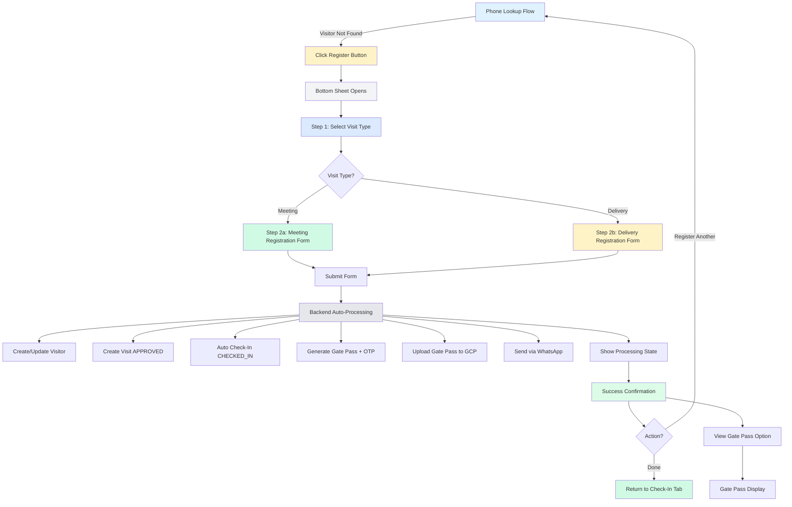

# UX Design: Security-Assisted Visitor Registration

> **Feature:** Unified Visitor Workflow - Security-Assisted Registration Flow
> **Version:** 1.0
> **Created:** 2025-02-20
> **Related:** docs/features/unified-visitor-workflow/UX-DESIGN.md

---

## 1. Overview

### 1.1 Problem Statement

Walk-in visitors present a challenge to the current visitor tracking system. While the public self-registration flow works for visitors who can use their phones and complete phone verification, many visitors arrive unregistered:

- **Walk-ins without phones**: Elderly visitors, children, or individuals without smartphones
- **Time-constrained scenarios**: Emergency deliveries, urgent meetings where visitor doesn't have time to complete full registration
- **Technical barriers**: Visitors unfamiliar with QR codes, SMS verification, or mobile apps
- **Security guard workflow**: Currently, guards must ask visitors to register via public kiosk or QR code, adding friction to the check-in process

### 1.2 Goals

1. **Streamlined Security Workflow**: Enable security guards to register visitors quickly and efficiently without requiring visitors to complete the full self-registration flow
2. **Immediate Access**: Since security verifies visitor identity in person (photo, ID check), bypass phone verification and auto-approve visits for instant access
3. **Context-Preserving Registration**: Keep security guards in the Check-In tab context using a bottom sheet/modal instead of navigating away
4. **Consistent Data Collection**: Maintain the same comprehensive data collection as public registration for meeting visitors (government ID, office ID)
5. **Minimal Friction**: Reduce steps and time required for walk-in registration while maintaining security standards

### 1.3 User Persona: The Security Guard

From the existing UX-DESIGN.md:

**Context:**
- **Primary Device**: Mobile phone (standing, patrolling, at gate)
- **Secondary Device**: Tablet/Laptop (supervisors, high-volume shifts)

**Needs:**
- One-handed operation for mobile use
- Large touch targets for outdoor use
- High contrast visibility
- Quick verification workflows
- Clear status indicators

**Tone:**
- Professional, alert
- "Process completed" rather than "Welcome"

**Current Pain Points:**
- "Register as new visitor" button in phone lookup is a placeholder with no functionality
- Must redirect visitors to public kiosk or QR code registration
- Cannot register visitors on behalf of those without phones
- Breaks workflow context by navigating away from Check-In tab

### 1.4 Design Decisions Summary

| Decision | Rationale |
|----------|-----------|
| **Phone Verification: SKIP** | Security verifies visitor identity in person (photo, ID check). No SMS OTP needed. |
| **Approval Mode: AUTO-APPROVE** | Since security verified identity, visits are auto-approved and visitor gets immediate gate pass. |
| **Gate Pass Delivery: WhatsApp** | Generate and send via WhatsApp (same as public flow). |
| **Data Collection: COMPLETE** | Same fields as public registration including government ID, office ID document uploads. |
| **UI Container: MODAL/BOTTOM SHEET** | Slides up from bottom on mobile, centered modal on tablet/desktop. Keeps context of Check-In tab. |
| **Entry Point: PHONE LOOKUP ONLY** | Triggered from "Not Found" state in phone lookup flow. |
| **Check-in Flow: AUTO CHECK-IN** | After registration completes, visitor is automatically marked as CHECKED_IN. No OTP verification needed. |
| **Host Selection: REQUIRED for Meeting** | Same searchable dropdown as public flow. |

---

## 2. User Flow Diagram



### Flow Summary

1. **Entry Point**: Security guard triggers registration from phone lookup "Not Found" state
2. **Type Selection**: Choose Meeting or Delivery (same as public flow)
3. **Data Collection**: Complete form with photo, documents (meeting), and visit details
4. **Auto-Processing**: Backend creates visitor, approves visit, checks in visitor, generates gate pass, sends WhatsApp
5. **Confirmation**: Show success with check-in confirmation and WhatsApp sent status
6. **Next Actions**: Register another visitor or return to Check-In tab

---

## 3. Step-by-Step Flow Specification

### 3.1 Step 1: Entry Point (Phone Lookup Not Found)

**Context:** Security guard enters visitor phone number in PhoneLookupFlow. API returns "not found" state.

**UI State:**
- Display "We couldn't find a visitor with this number."
- Show phone number: "+91 99999 9999" (the number entered)
- Primary action: "Register as new visitor" (opens bottom sheet/modal)
- Secondary action: "Search another" (resets phone input)

**Interaction:**
- Click "Register as new visitor" → Bottom sheet/modal slides up from bottom
- Phone number from lookup is pre-filled in registration form (read-only)
- Focus moves to First Name field in modal

**Wireframe (Phone Lookup Not Found):**
```
┌─────────────────────────────────────┐
│  ☰  Quick Check-In         [✕]     │
├─────────────────────────────────────┤
│                                     │
│   Enter visitor phone...             │
│   ┌─────────────────────────────┐   │
│   │  +91 99999 9999            │   │
│   └─────────────────────────────┘   │
│                                     │
│   ─────────────────────────────     │
│   ✓ Visitor Not Found               │
│                                     │
│   We couldn't find a visitor with   │
│   this number.                      │
│                                     │
│   [ Register as new visitor ]       │
│   (Primary button)                  │
│   [ Search another ]                │
│   (Secondary button)                │
│                                     │
└─────────────────────────────────────┘
```

---

### 3.2 Step 2: Type Selection (First Modal Step)

**Purpose:** Select visit type (Meeting or Delivery) to determine which form to display.

**UI Container:**
- **Mobile (< 768px)**: Bottom sheet sliding up from bottom (~85% viewport height)
- **Tablet/Desktop (≥ 768px)**: Centered modal (max-width 600px)
- **Drag handle**: Horizontal bar at top for bottom sheet drag gesture (mobile)

**Content:**
- Header: "New Visitor Registration"
- Subtext: "Select visit type to continue"
- Two cards side-by-side:
  - **Meeting Card**:
    - Icon: User/Meeple (👤)
    - Label: "Meeting"
    - Description: "Full visitor registration with ID documents"
    - Color: Emerald/Teal border and icon
  - **Delivery Card**:
    - Icon: Package (📦)
    - Label: "Delivery"
    - Description: "Quick registration for courier deliveries"
    - Color: Amber/Orange border and icon

**Interaction:**
- Tap Meeting → Navigate to Meeting Registration Form
- Tap Delivery → Navigate to Delivery Registration Form
- Tap outside modal / drag handle down → Close modal (confirmation dialog if form has data)
- Back button (top-left) → Close modal

**Wireframe (Type Selection - Mobile Bottom Sheet):**
```
┌─────────────────────────────────────┐
│  ━━━━━━━━━━━━━━━━━━━━━━━━━━     │  ← Drag handle (mobile)
│  ← [Cancel]              [✕]      │
├─────────────────────────────────────┤
│                                     │
│  New Visitor Registration            │
│  Select visit type to continue      │
│                                     │
│  ┌─────────────┐  ┌─────────────┐  │
│  │   [👤]      │  │   [📦]      │  │
│  │  Meeting    │  │  Delivery   │  │
│  │             │  │             │  │
│  │ Full visitor│  │ Quick reg   │  │
│  │ registration│  │ for courier │  │
│  │ with IDs    │  │ deliveries  │  │
│  └─────────────┘  └─────────────┘  │
│                                     │
│  (Emerald border)   (Amber border)   │
│                                     │
└─────────────────────────────────────┘
   ▲ Bottom sheet slides up
```

---

### 3.3 Step 3a: Meeting Registration Form

**Purpose:** Collect comprehensive visitor information for meeting visits including personal details, photo, government ID, office ID (optional), and host details.

**Data Fields:**

| Field | Required? | Type | Description |
|-------|-----------|------|-------------|
| First Name | Yes | Text | Min 2 characters |
| Last Name | Yes | Text | Min 2 characters |
| Email | Yes | Email | Valid email format |
| Phone | Pre-filled | Text | Read-only (from phone lookup) |
| Company | No | Text | Visitor's organization |
| Designation | No | Text | Visitor's job title |
| Address | No | Text | Visitor's address |
| Photo | Yes | File/Camera | Capture photo (max 5MB, JPG/PNG) |
| Government ID Document | Yes | File/Upload | Aadhaar, PAN, etc. (max 5MB, JPG/PNG/PDF) |
| Office ID Document | No | File/Upload | Company ID (max 5MB, JPG/PNG/PDF) |
| Host/Staff Selection | Yes | Dropdown | Searchable staff dropdown |
| Department | No | Dropdown | Department filter for host |
| Purpose of Visit | No | Text | Reason for visit |

**Form Layout (Single column, scrollable):**

1. **Header**: "Step 2 of 2 • Meeting Registration"
2. **Personal Information**:
   - First Name & Last Name (2 columns on desktop, stacked on mobile)
   - Email (full width)
   - Company, Designation, Address (optional, full width)
3. **Photo Section**:
   - Large capture button (120px x 120px)
   - Camera icon, "Take Photo" label
   - Preview after capture with remove option
4. **ID Verification Section**:
   - Government ID Document (required)
   - Upload/Capture button with file type hints
   - Office ID Document (optional)
5. **Visit Details Section**:
   - Host/Staff Selection (required, searchable dropdown)
   - Department (optional dropdown)
   - Purpose of Visit (optional text area)
6. **Actions**:
   - Back (ghost button, top-left)
   - Cancel (ghost button, top-right)
   - Submit (primary button, bottom, "Register & Check In")

**Interaction Specifications:**

**Photo Capture:**
- Tap "Take Photo" → Open camera on mobile device
- Use `capture="user"` attribute for front camera
- Show preview after capture (thumbnail with remove button)
- Allow retake by tapping photo
- Validate: Image type (JPEG/PNG), Max size 5MB

**Document Upload:**
- Tap "Upload Document" or "Take Photo" → Action sheet (mobile) / File dialog (desktop)
- Mobile options: "Take Photo", "Choose from Library"
- Desktop: Drag & drop zone + file picker
- Show file name after upload with remove button
- Validate: File type (JPG/PNG/PDF), Max size 5MB

**Host Selection:**
- Searchable dropdown with debounce (300ms)
- Type to filter staff list
- Show avatar, name, department in dropdown items
- Required validation (show error if not selected)
- Keyboard navigation support

**Form Validation:**
- Validate on blur for individual fields
- Full validation on submit
- Show inline errors below fields (red text)
- Highlight invalid fields (red border)

**Wireframe (Meeting Form - Mobile Bottom Sheet):**
```
┌─────────────────────────────────────┐
│  ━━━━━━━━━━━━━━━━━━━━━━━━━━     │
│  ← [Back]        [Cancel] [✕]      │
├─────────────────────────────────────┤
│  Step 2 of 2 • Meeting Registration│
│  (Scrollable content area)          │
│                                     │
│  Personal Information               │
│  ┌──────────┐ ┌──────────┐          │
│  │First Name│ │Last Name │          │
│  └──────────┘ └──────────┘          │
│  Email *                           │
│  ┌─────────────────────────────┐    │
│  │                             │    │
│  └─────────────────────────────┘    │
│  Company (optional)                 │
│  ┌─────────────────────────────┐    │
│  │                             │    │
│  └─────────────────────────────┘    │
│  Designation (optional)              │
│  ┌─────────────────────────────┐    │
│  │                             │    │
│  └─────────────────────────────┘    │
│                                     │
│  Visitor Photo *                     │
│  ┌─────────────────────────────┐    │
│  │       📷  Take Photo        │    │
│  │      (120px x 120px)        │    │
│  └─────────────────────────────┘    │
│                                     │
│  ID Verification                    │
│  Government ID *                    │
│  ┌─────────────────────────────┐    │
│  │  📎 Upload / 📷 Capture     │    │
│  │  (Aadhaar, PAN, etc.)        │    │
│  └─────────────────────────────┘    │
│  Office ID (optional)              │
│  ┌─────────────────────────────┐    │
│  │  📎 Upload / 📷 Capture     │    │
│  └─────────────────────────────┘    │
│                                     │
│  Visit Details                      │
│  Host / Staff *                     │
│  ┌─────────────────────────────┐    │
│  │  Search staff...             │    │
│  │  ┌─────────────────────┐    │    │
│  │  │ 👤 Dr. Smith        │    │    │
│  │  │    Cardiology       │    │    │
│  │  └─────────────────────┘    │    │
│  └─────────────────────────────┘    │
│  Department (optional)              │
│  ┌─────────────────────────────┐    │
│  │  Cardiology ▼               │    │
│  └─────────────────────────────┘    │
│  Purpose (optional)                 │
│  ┌─────────────────────────────┐    │
│  │                             │    │
│  └─────────────────────────────┘    │
│                                     │
│  ─────────────────────────────     │
│  [Register & Check In]             │
│  (Full-width primary button)       │
│                                     │
└─────────────────────────────────────┘
   ▲ Scrollable within bottom sheet
```

---

### 3.4 Step 3b: Delivery Registration Form

**Purpose:** Collect minimal visitor information for delivery visits - fast-track registration for courier/packages.

**Data Fields:**

| Field | Required? | Type | Description |
|-------|-----------|------|-------------|
| First Name | Yes | Text | Min 2 characters |
| Last Name | Yes | Text | Min 2 characters |
| Phone | Pre-filled | Text | Read-only (from phone lookup) |
| Photo | Yes | File/Camera | Capture photo (max 5MB, JPG/PNG) |
| Platform/Company | Yes | Dropdown | Pre-defined options + "Other" |
| Recipient Name or Department | Yes | Text | Who/Where is the delivery for |

**Form Layout (Single column, compact):**

1. **Header**: "Step 2 of 2 • Delivery Registration"
2. **Personal Information**:
   - First Name & Last Name (2 columns on desktop, stacked on mobile)
3. **Photo Section**:
   - Large capture button (120px x 120px)
   - Camera icon, "Take Photo" label
4. **Delivery Details**:
   - Platform/Company dropdown (Zomato, Swiggy, Amazon, Flipkart, BlueDart, Other)
   - If "Other" selected → Show text input for custom company
   - Recipient Name or Department (text input)
5. **Actions**:
   - Back (ghost button, top-left)
   - Cancel (ghost button, top-right)
   - Submit (primary button, bottom, "Register & Check In")

**Platform/Company Dropdown Options:**

- Zomato (Food delivery)
- Swiggy (Food delivery)
- Amazon (E-commerce)
- Flipkart (E-commerce)
- BlueDart (Courier)
- Delhivery (Courier)
- FedEx (Courier)
- Other (custom input)

**Interaction Specifications:**

- Same photo capture behavior as Meeting form
- Platform/Company dropdown auto-selects on first open
- If "Other" selected → expand text input field below
- Validation: All required fields must be filled

**Wireframe (Delivery Form - Mobile Bottom Sheet):**
```
┌─────────────────────────────────────┐
│  ━━━━━━━━━━━━━━━━━━━━━━━━━━     │
│  ← [Back]        [Cancel] [✕]      │
├─────────────────────────────────────┤
│  Step 2 of 2 • Delivery Registration│
│  (Compact, non-scrollable)          │
│                                     │
│  Personal Information               │
│  ┌──────────┐ ┌──────────┐          │
│  │First Name│ │Last Name │          │
│  └──────────┘ └──────────┘          │
│                                     │
│  Visitor Photo *                     │
│  ┌─────────────────────────────┐    │
│  │       📷  Take Photo        │    │
│  └─────────────────────────────┘    │
│                                     │
│  Delivery Details                   │
│  Platform / Company *                │
│  ┌─────────────────────────────┐    │
│  │  Zomato ▼                   │    │
│  │  Swiggy                      │    │
│  │  Amazon                      │    │
│  │  Flipkart                    │    │
│  │  BlueDart                    │    │
│  │  Other...                    │    │
│  └─────────────────────────────┘    │
│                                     │
│  Recipient Name or Dept *           │
│  ┌─────────────────────────────┐    │
│  │                             │    │
│  └─────────────────────────────┘    │
│                                     │
│  ─────────────────────────────     │
│  [Register & Check In]             │
│  (Full-width primary button)       │
│                                     │
└─────────────────────────────────────┘
```

---

### 3.5 Step 4: Auto-Processing (Backend)

This step is invisible to the user but critical to the flow. When the guard clicks "Register & Check In":

**Backend Sequence:**

1. **Create/Update Visitor Record**:
   - Search for existing visitor by phone + branchId
   - If found: Update personal fields (first name, last name, email, company, designation, address)
   - If not found: Create new visitor record
   - Upload and store photo, government ID document, office ID document

2. **Create Visit Record**:
   - Create new visit with status `APPROVED` (auto-approval)
   - Associate with visitor ID, branch ID
   - Store visit type (MEETING or DELIVERY)
   - For Meeting: Store host ID, department, purpose
   - For Delivery: Store platform/company, recipient

3. **Auto Check-In**:
   - Update visit status to `CHECKED_IN`
   - Record check-in timestamp
   - Generate Check-In OTP (6-digit random code)
   - Store OTP in visit record

4. **Generate Gate Pass**:
   - Compose gate pass image with visitor photo, name, visit details, OTP
   - Include "Checked In" badge
   - Add timestamp and validity

5. **Upload to GCP Storage**:
   - Upload gate pass image to GCP bucket
   - Store image URL in visit record

6. **Send via WhatsApp**:
   - Use WhatsApp Business API to send gate pass image
   - Include message: "Your gate pass is ready. Show this to security."
   - Include OTP in message text for reference

**Frontend Display During Processing:**
- Show loading state with spinner
- Display "Registering visitor and generating gate pass..."
- Disable all form fields and buttons
- Prevent form closure during processing

**Wireframe (Processing State):**
```
┌─────────────────────────────────────┐
│  ━━━━━━━━━━━━━━━━━━━━━━━━━━     │
│                                 │
│  [Spinner animation]               │
│                                     │
│  Registering visitor...             │
│                                     │
│  Generating gate pass...            │
│                                     │
│  (Buttons disabled)                 │
│                                     │
└─────────────────────────────────────┘
```

---

### 3.6 Step 5: Success Confirmation

**Purpose:** Confirm successful registration and check-in, show WhatsApp delivery status, provide next actions.

**Display Elements:**

1. **Success Icon**: Large green checkmark ✓
2. **Visitor Name**: "John Doe checked in successfully"
3. **Check-In Status Badge**: "Checked In" (Emerald/green badge)
4. **WhatsApp Confirmation**: "Gate Pass sent via WhatsApp to +91 99999 9999"
5. **View Gate Pass Option**: Button to view gate pass within modal
6. **Action Buttons**:
   - "Register Another Visitor" (Primary)
   - "Done" (Secondary - closes modal and returns to Check-In tab)

**Interaction:**

- "Register Another Visitor" → Reset form, return to Step 2 (Type Selection)
  - Keep phone number from previous lookup (read-only)
  - Focus First Name field
- "Done" → Close modal, return to Check-In tab
  - Refresh logs in Check-In tab to show new checked-in visitor
- "View Gate Pass" → Show gate pass in modal (full-screen overlay within modal)
  - Use GatePassView component
  - Show "Close" button to return to confirmation

**Wireframe (Success Confirmation):**
```
┌─────────────────────────────────────┐
│  ━━━━━━━━━━━━━━━━━━━━━━━━━━     │
│                                 │
│           ✓                       │
│     (Large green checkmark)         │
│                                     │
│  John Doe checked in successfully   │
│                                     │
│  ┌──────────┐                       │
│  │ Checked  │                       │
│  │   In     │  (Emerald badge)      │
│  └──────────┘                       │
│                                     │
│  ─────────────────────────────     │
│                                     │
│  ✓ Gate Pass sent via WhatsApp     │
│    to +91 99999 9999               │
│                                     │
│  [ View Gate Pass ]                │
│  (Secondary button)                │
│                                     │
│  ─────────────────────────────     │
│  [ Register Another Visitor ]      │
│  (Primary button)                   │
│  [ Done ]                          │
│  (Secondary button)                 │
│                                     │
└─────────────────────────────────────┘
```

---

### 3.7 Step 6: Gate Pass Display (Within Modal)

**Purpose:** View the gate pass within the modal for confirmation or WhatsApp failure scenarios.

**Display:**
- Use existing `GatePassView` component
- Show visitor photo, name, visit details
- Display Check-In OTP prominently
- Include "Checked In" badge (instead of "Approved")

**Interaction:**
- "Close" button → Return to success confirmation
- "Download" button → Save gate pass image to device (optional)

**Wireframe (Gate Pass Within Modal):**
```
┌─────────────────────────────────────┐
│  [Checked In]      Gate Pass   [✕]  │
├─────────────────────────────────────┤
│                                     │
│         ┌─────────┐                 │
│         │  👤     │                 │
│         │  Photo  │                 │
│         └─────────┘                 │
│         John Doe                    │
│         +91 99999 99999             │
│                                     │
│   ┌──────────┐  ┌──────────┐        │
│   │ Meeting  │  │ Checked  │        │
│   └──────────┘  │   In     │        │
│                └──────────┘        │
│                                     │
│   Host: Dr. Smith                   │
│   Department: Cardiology            │
│   Purpose: Consultation             │
│   ─────────────────────────────     │
│   SHOW TO SECURITY:                 │
│                                     │
│      8 4 7 2 9 1                    │
│    (Large OTP Display)              │
│                                     │
│   ─────────────────────────────     │
│   Checked in at: 10:35 AM           │
│                                     │
│   [ Download ]  [ Close ]            │
│                                     │
└─────────────────────────────────────┘
```

---

## 4. Component States

### 4.1 Register Button (Phone Lookup Not Found State)

| State | Visual | Behavior |
|-------|--------|----------|
| **Default** | Solid emerald-600 background, white text | Enabled, clickable |
| **Hover** | Darker emerald-700 background | Cursor pointer |
| **Active** | Slightly darker emerald-700 | Button depressed visual |
| **Disabled** | Gray-300 background, gray-500 text | Not clickable (not used in this context) |

### 4.2 Type Selection Cards

| State | Visual | Behavior |
|-------|--------|----------|
| **Default** | Light gray-50 background, 1px border gray-200 | Enabled, clickable |
| **Hover** | Lighter colored background (emerald-50 for Meeting, amber-50 for Delivery), 2px border | Cursor pointer |
| **Active/Selected** | Colored background (emerald-100 for Meeting, amber-100 for Delivery), 2px border (emerald-500/amber-500) | Selected state, ready to proceed |
| **Focused** | Focus ring (ring-2 ring-emerald-500) | Keyboard focus |

### 4.3 Form Inputs (Text, Email, Dropdown)

| State | Visual | Behavior |
|-------|--------|----------|
| **Default** | White background, 1px border gray-300, 48px height | Enabled, editable |
| **Focused** | White background, 2px border emerald-500, focus ring | Typing, focus visible |
| **Error** | White background, 2px border red-500, error text below | Invalid input, show error message |
| **Disabled** | Gray-100 background, gray-400 text, 1px border gray-200 | Not editable (e.g., Phone field) |
| **Loading** | Spinner overlay (for async dropdowns) | Loading options |

### 4.4 Photo Capture Button

| State | Visual | Behavior |
|-------|--------|----------|
| **Empty** | Dashed border (border-dashed border-2 border-gray-300), gray-400 text, camera icon | Click to capture |
| **Hover** | Lighter background (gray-50), border color darkens | Cursor pointer |
| **Filled** | Solid border, photo preview thumbnail, remove button (X) | Photo captured |
| **Error** | Red border, error message below | Invalid file type/size |
| **Loading** | Spinner over button | Capturing/uploading |

### 4.5 Document Upload Fields

| State | Visual | Behavior |
|-------|--------|----------|
| **Empty** | Dashed border, upload/capture button centered, file type hint text | Click to upload/capture |
| **Hover** | Lighter background, border color darkens | Cursor pointer |
| **Filled** | File icon, file name, remove button (X) | File uploaded |
| **Error** | Red border, error message below | Invalid file type/size |
| **Loading** | Spinner over field | Uploading |

### 4.6 Host Search Dropdown

| State | Visual | Behavior |
|-------|--------|----------|
| **Closed** | Read-only input with placeholder "Search staff..." | Click to open |
| **Open/Expanded** | Dropdown list with search results, filtered by input | Show matching staff |
| **Loading** | Spinner below input | Loading options |
| **No Results** | "No staff found" message in dropdown | No matching staff |
| **Error** | Red border, error message "Failed to load staff" | API failure |
| **Selected** | Staff avatar, name, department visible in input | Staff selected |

### 4.7 Submit Button ("Register & Check In")

| State | Visual | Behavior |
|-------|--------|----------|
| **Default** | Solid emerald-600 background, white text | Enabled, clickable |
| **Disabled** | Gray-300 background, gray-500 text, no hover | Form invalid or loading |
| **Loading** | Spinner visible, button text "Registering...", disabled | Processing submission |
| **Error** | Red background, white text "Retry" | Submission failed |
| **Success** | (Not used - proceeds to confirmation) | - |

### 4.8 Modal/Bottom Sheet

| State | Visual | Behavior |
|-------|--------|----------|
| **Closed** | Not visible | Modal hidden |
| **Opening** | Slide up animation (fade + slide) from bottom | Animating in |
| **Open** | Full opacity, fully visible | Interactive |
| **Closing** | Slide down animation (fade + slide) | Animating out |
| **Processing** | Backdrop blur, dim overlay, modal content with spinner | Form submitting |

### 4.9 Action Buttons (Register Another, Done, Cancel)

| State | Visual | Behavior |
|-------|--------|----------|
| **Default** | Primary: emerald-600, Secondary: gray-100/gray-700 | Enabled, clickable |
| **Hover** | Darker shade | Cursor pointer |
| **Active** | Slightly darker shade | Button depressed |
| **Disabled** | Gray-300, no hover | Not enabled |

---

## 5. ASCII Wireframes

### 5.1 Phone Lookup - Not Found State (Mobile)

```
┌─────────────────────────────────────┐
│  ☰  Security Dashboard    [●] Live  │
├─────────────────────────────────────┤
│                                     │
│   Quick Check-In                    │
│   ┌─────────────────────────────┐   │
│   │ +91 99999 9999            │   │
│   └─────────────────────────────┘   │
│   [ 🔍 Check Visitor ]              │
│                                        │
│   ─────────────────────────────     │
│   ✓ Visitor Not Found               │
│                                     │
│   We couldn't find a visitor with   │
│   this number.                      │
│                                     │
│   [ Register as new visitor ]       │
│   (Primary - emerald)               │
│   [ Search another ]                │
│   (Secondary - gray)                │
│                                     │
├─────────────────────────────────────┤
│  [clipboard]      [list]            │
│   Check-In         Logs             │
└─────────────────────────────────────┘
```

### 5.2 Bottom Sheet - Type Selection (Mobile)

```
┌─────────────────────────────────────┐
│  Security Dashboard (blurred)       │
├─────────────────────────────────────┤
│  ━━━━━━━━━━━━━━━━━━━━━━━━━━     │  ← Drag handle
│  ← [Back]        [Cancel] [✕]      │
├─────────────────────────────────────┤
│                                     │
│  New Visitor Registration            │
│  Select visit type to continue      │
│                                     │
│  ┌───────────────────┐ ┌──────────┐│
│  │      [👤]         │ │  [📦]   ││
│  │                   │ │         ││
│  │     Meeting       │ │Delivery ││
│  │                   │ │         ││
│  │ Full visitor reg  │ │Quick    ││
│  │ with ID documents │ │courier  ││
│  └───────────────────┘ └──────────┘│
│  (emerald border)       (amber)    │
│                                     │
│                                     │
└─────────────────────────────────────┘
   ▲ Slides up from bottom
```

### 5.3 Bottom Sheet - Meeting Form (Mobile - Scrollable)

```
┌─────────────────────────────────────┐
│  ━━━━━━━━━━━━━━━━━━━━━━━━━━     │
│  ← [Back]        [Cancel] [✕]      │
├─────────────────────────────────────┤
│  Step 2 of 2 • Meeting             │
│  (scroll within this area ↓)       │
│                                     │
│  First Name *     Last Name *      │
│  ┌──────────┐     ┌──────────┐     │
│  │          │     │          │     │
│  └──────────┘     └──────────┘     │
│                                     │
│  Email *                           │
│  ┌─────────────────────────────┐    │
│  │                             │    │
│  └─────────────────────────────┘    │
│                                     │
│  Visitor Photo *                     │
│  ┌─────────────────────────────┐    │
│  │        📷  Take Photo       │    │
│  │         (120x120)           │    │
│  └─────────────────────────────┘    │
│                                     │
│  Government ID *                    │
│  ┌─────────────────────────────┐    │
│  │  📎 Upload / 📷 Capture     │    │
│  └─────────────────────────────┘    │
│                                     │
│  Host / Staff *                     │
│  ┌─────────────────────────────┐    │
│  │  Search staff...             │    │
│  │  👤 Dr. Smith - Cardiology   │    │
│  └─────────────────────────────┘    │
│                                     │
│  Purpose (optional)                 │
│  ┌─────────────────────────────┐    │
│  │                             │    │
│  └─────────────────────────────┘    │
│                                     │
│  [Register & Check In]             │
│  (full-width primary)               │
│                                     │
└─────────────────────────────────────┘
   ▲ Scrollable bottom sheet
```

### 5.4 Bottom Sheet - Delivery Form (Mobile - Compact)

```
┌─────────────────────────────────────┐
│  ━━━━━━━━━━━━━━━━━━━━━━━━━━     │
│  ← [Back]        [Cancel] [✕]      │
├─────────────────────────────────────┤
│  Step 2 of 2 • Delivery            │
│                                     │
│  First Name *     Last Name *      │
│  ┌──────────┐     ┌──────────┐     │
│  │          │     │          │     │
│  └──────────┘     └──────────┘     │
│                                     │
│  Visitor Photo *                     │
│  ┌─────────────────────────────┐    │
│  │        📷  Take Photo       │    │
│  └─────────────────────────────┘    │
│                                     │
│  Platform / Company *                │
│  ┌─────────────────────────────┐    │
│  │  Zomato ▼                   │    │
│  │  Swiggy                      │    │
│  │  Amazon                      │    │
│  │  Other...                    │    │
│  └─────────────────────────────┘    │
│                                     │
│  Recipient Name or Dept *           │
│  ┌─────────────────────────────┐    │
│  │                             │    │
│  └─────────────────────────────┘    │
│                                     │
│  [Register & Check In]             │
│  (full-width primary)               │
│                                     │
└─────────────────────────────────────┘
```

### 5.5 Bottom Sheet - Processing State

```
┌─────────────────────────────────────┐
│  ━━━━━━━━━━━━━━━━━━━━━━━━━━     │
│                                 │
│                                     │
│           ⟳                       │
│      (spinner animation)             │
│                                     │
│  Registering visitor...             │
│                                     │
│  Generating gate pass...            │
│                                     │
│  Sending via WhatsApp...            │
│                                     │
│  (content disabled, no actions)     │
│                                     │
│                                     │
└─────────────────────────────────────┘
```

### 5.6 Bottom Sheet - Success Confirmation

```
┌─────────────────────────────────────┐
│  ━━━━━━━━━━━━━━━━━━━━━━━━━━     │
│                                 │
│           ✓                       │
│     (large green checkmark)         │
│                                     │
│  John Doe checked in successfully   │
│                                     │
│  ┌──────────┐                       │
│  │ Checked  │                       │
│  │   In     │  (emerald badge)      │
│  └──────────┘                       │
│                                     │
│  ─────────────────────────────     │
│                                     │
│  ✓ Gate Pass sent via WhatsApp     │
│    to +91 99999 9999               │
│                                     │
│  [ View Gate Pass ]                │
│  (secondary button)                 │
│                                     │
│  ─────────────────────────────     │
│  [ Register Another Visitor ]      │
│  (primary button)                   │
│  [ Done ]                          │
│  (secondary button)                 │
│                                     │
└─────────────────────────────────────┘
```

### 5.7 Bottom Sheet - Gate Pass View (Meeting)

```
┌─────────────────────────────────────┐
│  [Checked In]   Gate Pass      [✕]  │
├─────────────────────────────────────┤
│                                     │
│         ┌─────────┐                 │
│         │  👤     │                 │
│         │  Photo  │                 │
│         └─────────┘                 │
│         John Doe                    │
│         +91 99999 99999             │
│                                     │
│   ┌──────────┐  ┌──────────┐        │
│   │ Meeting  │  │ Checked  │        │
│   └──────────┘  │   In     │        │
│                └──────────┘        │
│                                     │
│   Host: Dr. Smith                   │
│   Department: Cardiology            │
│   Purpose: Consultation             │
│   ─────────────────────────────     │
│   SHOW TO SECURITY:                 │
│                                     │
│      8 4 7 2 9 1                    │
│    (large monospace OTP)             │
│                                     │
│   ─────────────────────────────     │
│   Checked in at: 10:35 AM           │
│                                     │
│   [ Download ]  [ Close ]            │
│                                     │
└─────────────────────────────────────┘
```

### 5.8 Tablet/Desktop - Modal (Type Selection)

```
┌─────────────────────────────────────────────────────┐
│                                                     │
│                    (Modal centered)                 │
│  ┌─────────────────────────────────────────────┐   │
│  │  New Visitor Registration          [ ✕ ]    │   │
│  ├─────────────────────────────────────────────┤   │
│  │                                             │   │
│  │  Select visit type to continue               │   │
│  │                                             │   │
│  │  ┌─────────────────────┐ ┌───────────────┐ │   │
│  │  │      [👤]          │ │    [📦]      │ │   │
│  │  │                     │ │              │ │   │
│  │  │     Meeting         │ │   Delivery   │ │   │
│  │  │                     │ │              │ │   │
│  │  │ Full visitor reg    │ │ Quick reg    │ │   │
│  │  │ with ID documents   │ │ for courier  │ │   │
│  │  └─────────────────────┘ └───────────────┘ │   │
│  │                                             │   │
│  │                                             │   │
│  └─────────────────────────────────────────────┘   │
│                                                     │
└─────────────────────────────────────────────────────┘
```

---

## 6. Interaction Specifications

### 6.1 Modal Open/Close Behavior

**Opening:**
1. User clicks "Register as new visitor" in phone lookup
2. Modal/backdrop appears with fade-in animation (150ms)
3. Content slides up from bottom (mobile) or scales in (desktop) (300ms ease-out)
4. Focus is trapped within modal content
5. Focus moves to first interactive element (type selection card or form field)

**Closing:**
1. User clicks:
   - X button (top-right)
   - Cancel button
   - Back button (on type selection only)
   - Click outside modal (backdrop)
   - Press Escape key
2. Confirmation dialog if form has unsaved changes
3. Content slides down/out with animation (200ms ease-in)
4. Backdrop fades out
5. Focus returns to "Register as new visitor" button in phone lookup

**Swipe Gesture (Mobile):**
- Drag handle at top of bottom sheet
- Swipe down to close modal
- Swipe threshold: 50% of modal height

### 6.2 Back Navigation Within Modal

**From Type Selection:**
- Back button → Close modal, return to phone lookup
- No confirmation needed (no form data)

**From Meeting/Delivery Form:**
- Back button → Show confirmation dialog
  - "You have unsaved changes. Discard and go back?"
  - Buttons: "Discard Changes", "Keep Editing"
- If confirmed → Return to type selection, clear form data

**From Success Confirmation:**
- No back button (terminal state)
- Must use "Done" or "Register Another" actions

### 6.3 Cancel/Close Actions

**Cancel Button:**
- Available on all screens except success confirmation
- Always shows confirmation dialog if form has data
- Closes modal on confirmation

**X Button (Top-Right):**
- Same behavior as Cancel button
- Shortcut for quick closure

**Backdrops Click:**
- Click outside modal content → Same as Cancel button
- Disabled during form submission (processing)

### 6.4 Form Validation Timing

**On Blur:**
- Validate individual field when user leaves field
- Show inline error below field if invalid
- Remove error when field becomes valid

**On Submit:**
- Validate all fields when "Register & Check In" clicked
- Highlight first invalid field with error
- Focus first invalid field
- Prevent submission if invalid

**Real-time Feedback:**
- Phone field: Auto-format as user types (add spaces: +91 999 999 9999)
- Email field: Show valid/invalid indicator as user types (optional)
- Photo upload: Show preview immediately after selection
- File validation: Show error immediately after file selection

### 6.5 Photo Capture Trigger

**Mobile:**
- Tap "Take Photo" button
- Open device camera with `<input type="file" accept="image/*" capture="user">`
- Camera app launches, user takes photo
- On confirm: Return to form with photo preview
- On cancel: Return to form, no photo captured

**Desktop:**
- Tap "Take Photo" button
- Show action sheet: "Take Photo" / "Upload from Library"
- "Take Photo" → Open webcam (requires permission) or file dialog
- "Upload from Library" → File picker dialog
- On select: Preview photo in form

**Error Handling:**
- Camera permission denied: Show error, fallback to file upload
- Invalid file type: Show error "Please upload JPG or PNG", clear field
- File too large: Show error "Photo must be less than 5MB", clear field
- Capture fails: Show error, allow retry

### 6.6 Document Upload Behavior

**Action Sheet (Mobile):**
- Tap upload field → Show action sheet:
  - "Take Photo"
  - "Choose from Library"
  - "Upload File" (for PDF documents)

**File Picker (Desktop):**
- Click upload field → Open system file picker
- Accept: `.jpg`, `.jpeg`, `.png`, `.pdf`
- Select multiple files: Take first file only

**Upload Display:**
- Empty state: Upload/capture button with icon
- File selected: Show file icon + filename + file size
- Remove button (X): Clear field, return to empty state

**Validation:**
- File type: Accept JPG, PNG, PDF only
- File size: Max 5MB
- On invalid: Show error below field, clear selection

### 6.7 Searchable Host Dropdown Behavior

**Open:**
- Click dropdown or type in input field
- Show list of all staff members
- Show loading spinner if fetching

**Search:**
- Type in input field (debounce 300ms)
- Filter staff list by name, department
- Show "No staff found" if no matches
- Show loading spinner while filtering

**Select:**
- Click staff item → Close dropdown, show selected staff
- Display: Avatar + Name + Department
- Allow clearing selection (X button)

**Error Handling:**
- API failure: Show "Failed to load staff" error
- Retry button to reload list
- Fallback: Allow free-text entry if dropdown fails (optional)

### 6.8 Success Actions

**Register Another:**
- Click → Reset form to initial state
- Keep phone number from previous lookup (read-only)
- Return to Step 2 (Type Selection)
- Focus first type selection card
- Clear all form data except phone

**Done:**
- Click → Close modal
- Return to Check-In tab
- Refresh visitor logs in background
- Show toast notification: "Visitor registered and checked in"

**View Gate Pass:**
- Click → Show gate pass overlay within modal
- Display full gate pass with OTP
- "Close" button to return to confirmation
- "Download" button to save gate pass (optional)

---

## 7. Accessibility Requirements

### 7.1 Focus Management

**Modal Open:**
- Move focus to first interactive element in modal
- Trap focus within modal content
- Prevent tabbing to elements outside modal

**Modal Close:**
- Return focus to element that triggered modal (Register button)

**Focus Trap:**
- Use `focus-trap` or custom implementation
- Cycle focus through modal content
- Prevent escape from modal with Tab

**Focus Order:**
1. Close button (X) - skip for screen readers (use Esc)
2. Back button (if visible)
3. Type selection cards or form fields
4. Submit/primary action button
5. Secondary actions

### 7.2 Keyboard Navigation

**Tab:**
- Navigate through interactive elements
- Logical order: form fields → buttons
- Skip decorative elements

**Shift + Tab:**
- Navigate backwards through elements

**Enter:**
- Submit form when on submit button
- Select dropdown item
- Trigger primary action

**Escape:**
- Close modal
- Cancel form if on confirmation dialog
- Close dropdown if open

**Space:**
- Toggle checkboxes (if any)
- Same as Enter for buttons

**Arrow Keys:**
- Navigate dropdown options
- Navigate type selection cards (if using focus-visible)

### 7.3 Screen Reader Announcements

**Modal Open:**
- "New Visitor Registration dialog opened"
- "Dialog contains [number] interactive elements"
- Announce step indicator if visible

**State Changes:**
- Form validation errors: "Invalid [field name], [error message]"
- Loading state: "Processing, please wait"
- Success: "Registration successful, John Doe checked in"
- WhatsApp sent: "Gate pass sent via WhatsApp"

**Live Regions:**
- Use `aria-live="polite"` for non-critical updates
- Use `aria-live="assertive"` for errors
- Use `role="alert"` for validation errors

**Gate Pass:**
- Announce visitor name and check-in status
- Announce OTP: "Check-in one time password: 8-4-7-2-9-1"
- Announce validity: "Valid until [time]"

### 7.4 Form Field Labels and Error Associations

**Labels:**
- All inputs have `for` attribute linking to `id`
- Required fields marked with `*`
- Use `<label>` elements or `aria-label`

**Errors:**
- Error messages have `id="fieldname-error"`
- Inputs have `aria-describedby="fieldname-error"` on error
- Error text: Red, clear, actionable

**Screen Reader Example:**
```tsx
<div>
  <label for="firstName" id="firstName-label">
    First Name <span aria-hidden="true">*</span>
  </label>
  <input
    id="firstName"
    aria-required="true"
    aria-describedby="firstName-error"
    aria-invalid="true"
  />
  <span id="firstName-error" role="alert">
    First name must be at least 2 characters
  </span>
</div>
```

### 7.5 ARIA Attributes for Modal

**Modal Container:**
```tsx
<div
  role="dialog"
  aria-modal="true"
  aria-labelledby="modal-title"
  aria-describedby="modal-description"
>
  <h2 id="modal-title">New Visitor Registration</h2>
  <p id="modal-description">Select visit type to continue</p>
  <!-- Modal content -->
</div>
```

**Backdrop:**
```tsx
<div
  role="presentation"
  aria-hidden="true"
  onClick={handleClose}
>
  <!-- Backdrop -->
</div>
```

**Type Selection Cards:**
```tsx
<button
  role="radio"
  aria-checked={selected}
  aria-label="Meeting visit type"
>
  Meeting
</button>
```

**File Uploads:**
```tsx
<input
  type="file"
  aria-label="Upload government ID document"
  aria-describedby="govt-id-help"
/>
<span id="govt-id-help">
  Accepted formats: JPG, PNG, PDF. Max 5MB.
</span>
```

---

## 8. Mobile Considerations

### 8.1 Touch Targets

**Minimum Size:**
- Buttons: 44px x 44px minimum (48px recommended)
- Form inputs: 48px height minimum
- Checkboxes/radios: 44px x 44px tap area
- Type selection cards: Full width, minimum 80px height

**Spacing:**
- Minimum 8px between interactive elements
- 16px padding around form groups
- 24px padding at edges of modal

### 8.2 One-Handed Operation

**Bottom Sheet Design:**
- Primary actions at bottom of sheet (reachable with thumb)
- Cancel/Back buttons at top corners
- Important fields (photo capture) in upper-middle area
- Submit button always visible (sticky bottom if scrollable)

**Thumb Zone:**
- Place frequently used actions in bottom 30% of screen
- Place critical confirmations at bottom-right (natural thumb position)

### 8.3 Camera/Photo Capture UX

**Camera Trigger:**
- Large, prominent button (120px x 120px)
- Center of available space
- Clear icon (camera) and label ("Take Photo")

**Camera Permissions:**
- Request permission on first tap
- Show helpful message if denied
- Provide fallback to file upload

**Photo Preview:**
- Show thumbnail after capture
- Allow retake by tapping photo
- Remove button (X) in corner

**Orientation:**
- Support both portrait and landscape
- Maintain aspect ratio for photo capture area

### 8.4 Bottom Sheet Drag Handle

**Visual:**
- Horizontal bar (4px height, 40px width)
- Centered at top of sheet
- Gray-400 color, rounded corners

**Interaction:**
- Drag down to close modal
- Visual feedback: Sheet follows drag
- Threshold: 50% of sheet height to trigger close
- Snap back if not meeting threshold

**Touch Feedback:**
- Highlight handle on touch
- Show "swipe down to close" hint on first open (optional)

### 8.5 Keyboard Avoiding Input Fields

**Problem:**
- On-screen keyboard covers form fields when typing
- Bottom sheet height changes when keyboard opens

**Solutions:**

1. **Auto-scroll:**
   - When input focused, scroll form so input is visible
   - Maintain keyboard avoidance margin (safe area)

2. **Resize Sheet:**
   - Detect keyboard open (viewport height change)
   - Resize bottom sheet to fit available space
   - Keep sheet anchored to keyboard top

3. **Viewport Meta:**
   ```html
   <meta name="viewport" content="width=device-width, initial-scale=1.0, maximum-scale=1.0, user-scalable=no" />
   ```

**Implementation:**
```tsx
useEffect(() => {
  const handleResize = () => {
    const keyboardHeight = window.innerHeight - window.visualViewport.height;
    setSheetHeight(sheetHeight - keyboardHeight);
  };
  window.visualViewport.addEventListener('resize', handleResize);
  return () => window.visualViewport.removeEventListener('resize', handleResize);
}, []);
```

### 8.6 Scrolling Within Modal for Long Forms

**Meeting Form:**
- Scrollable content area within bottom sheet
- Fixed header with step indicator and Back/Cancel buttons
- Fixed footer with Submit button
- Scroll area: Everything between header and footer

**Behavior:**
- Smooth scrolling when using keyboard (focus)
- Scroll indicators (gradient fade at edges) when content overflows
- Maintain scroll position when changing fields

**Implementation:**
```tsx
<div className="flex flex-col h-[85vh]">
  {/* Fixed Header */}
  <div className="flex-shrink-0">
    Header
  </div>

  {/* Scrollable Content */}
  <div className="flex-1 overflow-y-auto">
    Form fields...
  </div>

  {/* Fixed Footer */}
  <div className="flex-shrink-0">
    Submit button
  </div>
</div>
```

---

## 9. Microcopy Reference

### 9.1 Modal Titles and Headers

| Context | Text | Tone |
|---------|------|------|
| Type Selection Header | "New Visitor Registration" | Neutral, clear |
| Type Selection Subtext | "Select visit type to continue" | Guiding |
| Meeting Form Header | "Step 2 of 2 • Meeting Registration" | Step-by-step |
| Delivery Form Header | "Step 2 of 2 • Delivery Registration" | Step-by-step |
| Success Header | "Registration Complete" | Celebratory |

### 9.2 Form Labels and Placeholders

| Field | Label | Placeholder | Required |
|-------|-------|-------------|----------|
| First Name | "First Name" | "" | Yes (*) |
| Last Name | "Last Name" | "" | Yes (*) |
| Email | "Email" | "example@email.com" | Yes (*) |
| Phone | "Phone Number" | "" | Yes (read-only) |
| Company | "Company" | "e.g., ABC Corp" | No |
| Designation | "Designation" | "e.g., Manager" | No |
| Address | "Address" | "" | No |
| Photo | "Visitor Photo" | "" | Yes (*) |
| Government ID | "Government ID Document" | "Aadhaar, PAN, etc." | Yes (*) |
| Office ID | "Office ID Document" | "Company ID card" | No |
| Host | "Host / Staff" | "Search staff..." | Yes (*) |
| Department | "Department" | "" | No |
| Purpose | "Purpose of Visit" | "e.g., Consultation" | No |
| Platform/Company | "Platform / Company" | "" | Yes (*) |
| Recipient | "Recipient Name or Department" | "Who is this delivery for?" | Yes (*) |

### 9.3 Buttons

| Context | Primary | Secondary | Ghost |
|---------|---------|-----------|-------|
| Phone Lookup | "Register as new visitor" | "Search another" | - |
| Type Selection | - | - | "← Back", "Cancel" |
| Form Submit | "Register & Check In" | - | "← Back", "Cancel" |
| Success | "Register Another Visitor" | "Done", "View Gate Pass" | - |
| Gate Pass | "Download" | "Close" | - |
| Confirm Dialog | "Discard Changes" | "Keep Editing" | - |

### 9.4 Loading Messages

| Context | Text |
|---------|------|
| Form Submission | "Registering visitor..." |
| Generating Gate Pass | "Generating gate pass..." |
| WhatsApp Sending | "Sending via WhatsApp..." |
| General Processing | "Processing, please wait..." |

### 9.5 Success Messages

| Context | Text |
|---------|------|
| Registration Success | "John Doe checked in successfully" |
| WhatsApp Sent | "✓ Gate Pass sent via WhatsApp to +91 99999 9999" |
| Auto-Approved | "Visit auto-approved" (implied, not shown) |

### 9.6 Error Messages

| Error | Text |
|-------|------|
| Required Field | "[Field name] is required" |
| Min Length | "[Field name] must be at least 2 characters" |
| Email Invalid | "Please enter a valid email address" |
| File Type | "Please upload a valid image (JPG, PNG)" |
| File Size | "File size exceeds 5MB limit" |
| Phone Format | "Phone number must be 10 digits" |
| Host Required | "Please select a host / staff member" |
| Network Error | "Connection lost. Please check your internet and try again." |
| API Error | "Registration failed. Please try again." |
| Camera Denied | "Unable to access camera. Please check permissions or use file upload." |
| WhatsApp Failed | "Failed to send via WhatsApp. Please show gate pass manually." |

### 9.7 Help Text

| Context | Text |
|---------|------|
| Government ID Hint | "Accepted: Aadhaar, PAN, Driver's License (JPG, PNG, PDF)" |
| Office ID Hint | "Optional: Company ID card (JPG, PNG, PDF)" |
| Photo Hint | "Take a clear photo of the visitor" |
| Host Search Hint | "Type to search staff members" |
| Platform Options Hint | "Select from list or choose 'Other'" |

### 9.8 ARIA Labels (Screen Reader)

| Element | ARIA Label |
|---------|------------|
| Close Button (X) | "Close dialog" |
| Back Button | "Go back to visit type selection" |
| Cancel Button | "Cancel registration" |
| Photo Capture | "Take visitor photo" |
| Document Upload | "Upload government ID document" |
| Host Search | "Search for host or staff member" |
| Type Selection - Meeting | "Meeting visit type" |
| Type Selection - Delivery | "Delivery visit type" |
| Submit Button | "Register visitor and check in" |
| Register Another | "Register another visitor" |
| View Gate Pass | "View gate pass" |

---

## 10. Error Handling

### 10.1 Network Failure During Submission

**Scenario:** Guard clicks "Register & Check In" but network is unavailable.

**Behavior:**
1. Show inline error: "Connection lost. Please check your internet and try again."
2. Retry button: "Try Again" (primary)
3. Keep all form data preserved
4. Allow editing of form fields
5. Do not close modal

**UI:**
```
┌─────────────────────────────────────┐
│  ❌ Registration Failed              │
│                                     │
│  Connection lost. Please check       │
│  your internet and try again.        │
│                                     │
│  [ Try Again ]   [ Cancel ]         │
│                                     │
└─────────────────────────────────────┘
```

### 10.2 WhatsApp Delivery Failure (Non-Blocking)

**Scenario:** Gate pass generated and uploaded successfully, but WhatsApp send fails.

**Behavior:**
1. Show success confirmation (visitor checked in)
2. Show warning message: "⚠ Failed to send gate pass via WhatsApp"
3. Provide "View Gate Pass" button prominently
4. Instruct guard to show gate pass to visitor manually
5. Do not block the flow (visitor is still checked in)

**UI:**
```
┌─────────────────────────────────────┐
│           ✓                         │
│  John Doe checked in successfully   │
│                                     │
│  ⚠ Failed to send via WhatsApp      │
│                                     │
│  Please show the gate pass to the   │
│  visitor manually.                 │
│                                     │
│  [ View Gate Pass ]  (highlighted)  │
│  [ Register Another ]  [ Done ]     │
│                                     │
└─────────────────────────────────────┘
```

### 10.3 Photo/Document Upload Failure

**Scenario:** Photo capture or document upload fails during form submission.

**Behavior:**
1. Show specific error for each failed upload
2. Highlight failed fields with red border
3. Allow retrying photo/document capture
4. Keep other valid form data preserved
5. Do not proceed to backend submission until all uploads succeed

**UI:**
```
┌─────────────────────────────────────┐
│  ❌ Upload Failed                   │
│                                     │
│  Photo upload failed. Please try     │
│  again or select a different file.   │
│                                     │
│  Visitor Photo *                     │
│  ┌─────────────────────────────┐    │
│  │  ❌ Upload failed            │    │
│  └─────────────────────────────┘    │
│  [ Retry Photo ]                    │
│                                     │
│  [ Register & Check In ] (disabled) │
│                                     │
└─────────────────────────────────────┘
```

### 10.4 Host Search API Failure

**Scenario:** Host dropdown fails to load staff list.

**Behavior:**
1. Show error: "Failed to load staff list"
2. Retry button: "Retry"
3. Fallback: Allow free-text entry for host name (if backend supports)
4. If no fallback, show toast and disable form submission

**UI:**
```
┌─────────────────────────────────────┐
│  Host / Staff *                     │
│  ┌─────────────────────────────┐    │
│  │ Search staff...             │    │
│  └─────────────────────────────┘    │
│                                     │
│  ❌ Failed to load staff list       │
│  [ Retry ]  [ Enter name manually ] │
│                                     │
└─────────────────────────────────────┘
```

### 10.5 Form Validation Errors

**Scenario:** User submits form with invalid data.

**Behavior:**
1. Run full validation on all fields
2. Show inline errors below each invalid field
3. Highlight invalid fields with red border
4. Focus first invalid field
5. Disable submit button until all valid
6. Show summary error: "Please fix the errors above"

**Validation Rules:**
- **First/Last Name**: Min 2 characters, max 50
- **Email**: Valid email format
- **Phone**: Exactly 10 digits (pre-filled, read-only)
- **Photo**: Required, valid image type, max 5MB
- **Government ID**: Required, valid file type, max 5MB
- **Host**: Required selection
- **Platform/Company**: Required selection
- **Recipient**: Required (for delivery)

**UI:**
```
┌─────────────────────────────────────┐
│  First Name *                        │
│  ┌─────────────────────────────┐    │
│  │ J                           │    │
│  └─────────────────────────────┘    │
│  ❌ First name must be at least     │
│     2 characters                    │
│                                     │
│  [ Register & Check In ] (disabled) │
│                                     │
└─────────────────────────────────────┘
```

### 10.6 Backend Validation Errors

**Scenario:** Frontend validation passes, but backend rejects data.

**Behavior:**
1. Show error toast: "Registration failed: [backend error message]"
2. Keep form data preserved
3. Highlight affected fields if backend returns field-specific errors
4. Allow user to correct and retry

**Possible Backend Errors:**
- "Host not found"
- "Invalid file format"
- "Duplicate visitor record"
- "Branch not authorized"

---

## 11. Integration Points

### 11.1 PhoneLookupFlow Component

**Location:** `frontend/src/app/security/dashboard/components/PhoneLookupFlow.tsx`

**Integration:**
- Replace placeholder `handleRegisterNew()` function
- Open modal/bottom sheet when "Register as new visitor" clicked
- Pass phone number to modal component
- Receive callback when registration completes
- Refresh phone lookup results after registration

**Props to Pass:**
```tsx
interface PhoneLookupFlowProps {
  // ... existing props
  onRegisterNew?: (phone: string) => void;
}
```

**New Handler:**
```tsx
function handleRegisterNew() {
  if (onRegisterNew) {
    onRegisterNew(phoneValue);
  }
}
```

### 11.2 Form Components (Reusable)

**Existing Components:**

| Component | Reuse? | Modifications |
|-----------|--------|---------------|
| `MeetingRegistrationForm` | Yes | Add `skipPhoneVerification` prop, add `onSubmit` callback for auto-processing |
| `DeliveryRegistrationForm` | Yes | Add `skipPhoneVerification` prop, add `onSubmit` callback for auto-processing |
| `FileUploadField` | Yes | No changes needed |
| `GatePassView` | Yes | Add `checkedIn` prop variant |

**Modifications for Reuse:**

```tsx
// Modified MeetingRegistrationForm props
interface MeetingRegistrationFormProps {
  phone: string;
  branchId: string;
  isExistingVisitor: boolean;
  existingVisitorData?: ExistingVisitorData | null;
  onSubmit: (data: MeetingFormData) => void; // Existing
  onBack: () => void; // Existing
  isLoading?: boolean; // Existing

  // New props for security-assisted flow
  skipPhoneVerification?: boolean; // Auto-approve, skip OTP
  mode?: 'public' | 'security'; // UI mode (tone differences)
}
```

**Mode Differences:**
- `mode: 'security'`:
  - Remove phone verification steps
  - Direct form submission
  - Professional tone labels
  - High contrast colors
- `mode: 'public'`:
  - Include phone verification steps
  - Friendly tone labels
  - Gradients, illustrations

### 11.3 GatePassView Component

**Location:** `frontend/src/components/visitors/shared/GatePassView.tsx`

**New Variant: Checked In**

Add `checkedIn` prop to show "Checked In" badge instead of "Approved":

```tsx
interface GatePassViewProps {
  visitor: VisitorData;
  otp: string;
  validityTimestamp: Date;
  loading?: boolean;
  error?: string | null;
  expired?: boolean;
  showQRCode?: boolean;
  checkedIn?: boolean; // NEW: Show "Checked In" badge
  className?: string;
}
```

**Badge Display Logic:**
```tsx
{checkedIn ? (
  <Badge variant="success" className="bg-emerald-500">Checked In</Badge>
) : (
  <Badge variant="success" className="bg-emerald-500">Approved</Badge>
)}
```

### 11.4 Security Dashboard State Management

**Location:** `frontend/src/app/security/dashboard/page.tsx`

**State Updates:**

```tsx
// Add modal state
const [registrationModalOpen, setRegistrationModalOpen] = useState(false);
const [registrationPhone, setRegistrationPhone] = useState<string | null>(null);

// Handle registration trigger from PhoneLookupFlow
function handleRegisterNew(phone: string) {
  setRegistrationPhone(phone);
  setRegistrationModalOpen(true);
}

// Handle registration success
function handleRegistrationSuccess(visitorData: VisitorData) {
  setRegistrationModalOpen(false);
  setRegistrationPhone(null);

  // Refresh visitor logs
  refetchLogs();

  // Show success toast
  toast.success('Visitor registered and checked in', {
    description: `${visitorData.firstName} ${visitorData.lastName} is now checked in.`
  });
}
```

### 11.5 Backend API Endpoints Needed

**New or Modified Endpoints:**

| Endpoint | Method | Purpose | Existing? |
|----------|--------|---------|-----------|
| `/api/visitors/security/register` | POST | Security-assisted registration with auto-approval | **New** |
| `/api/visitors/search` | GET | Phone lookup (already exists) | Yes |
| `/api/staff/search` | GET | Search staff for host dropdown | Yes (reuse) |
| `/api/visitors/upload` | POST | Upload photo/documents (or use multipart in register) | Maybe (reuse) |

**Security-Assisted Registration Endpoint:**

```typescript
// POST /api/visitors/security/register
interface SecurityRegistrationRequest {
  branchId: string;

  // Visitor data
  firstName: string;
  lastName: string;
  email: string;
  phone: string;
  company?: string | null;
  designation?: string | null;
  address?: string | null;

  // Files (multipart form data)
  photo: File;
  governmentIdDocument: File;
  officeIdDocument?: File | null;

  // Visit data
  visitType: 'MEETING' | 'DELIVERY';

  // Meeting-specific
  hostId?: string | null;
  department?: string | null;
  purpose?: string | null;

  // Delivery-specific
  platform?: string | null;
  recipient?: string | null;

  // Security mode
  skipPhoneVerification: true; // Always true for security flow
  autoApprove: true; // Always true for security flow
  autoCheckIn: true; // Always true for security flow
}

interface SecurityRegistrationResponse {
  visitor: VisitorData;
  visit: VisitData;
  gatePassUrl: string;
  otp: string;
  whatsappSent: boolean;
  checkedIn: boolean;
}
```

### 11.6 WhatsApp Integration

**Existing Integration:**
- Use existing WhatsApp Business API client
- Reuse gate pass image generation
- Same message template as public flow

**Message Template:**
```
Your gate pass is ready. Show this to security for entry.

Visitor: {visitorName}
Status: Checked In
OTP: {otp}

[Gate Pass Image]
```

---

## 12. Open Questions for Architecture

### 12.1 New API Endpoint vs Extending Existing

**Question:** Should we create a new endpoint `/api/visitors/security/register` or extend the existing `/api/visitors/register` endpoint?

**Options:**

1. **New Endpoint** (Recommended):
   - `/api/visitors/security/register`
   - Separate endpoint for security-assisted flow
   - Clear separation of concerns
   - Easier to add security-specific logic
   - Can use different authentication (JWT session vs OTP-based)

2. **Extend Existing Endpoint**:
   - Add `mode: 'public' | 'security'` to existing `/api/visitors/register`
   - Share common registration logic
   - Risk of complex conditional logic
   - Security implications (authorization checks)

**Recommendation:** Create new endpoint for clarity and separation of concerns.

### 12.2 How to Handle Auto-Approval in Backend?

**Question:** How should the backend implement auto-approval for security-assisted registrations?

**Options:**

1. **Explicit Flags in Request**:
   ```typescript
   {
     autoApprove: true,
     autoCheckIn: true,
     approvedBy: securityUserId // Track who approved
   }
   ```
   - Clear intent in API contract
   - Audit trail: Who approved, when, why
   - Enforce authorization: Only security users can set these flags

2. **Implicit by Auth Role**:
   ```typescript
   // If JWT has SECURITY role, auto-approve
   if (user.role === 'SECURITY' || user.role === 'SECURITY_SUPERVISOR') {
     // Auto-approve and check-in
   }
   ```
   - Simpler API contract
   - Hidden behavior
   - Harder to audit

**Recommendation:** Explicit flags (`autoApprove: true`, `approvedBy: securityUserId`) for auditability and clarity.

### 12.3 How to Handle Auto Check-In Without OTP Verification?

**Question:** How should the backend generate and use OTP when auto-checking in without visitor verification?

**Current Flow (Public):**
1. Visitor submits registration → Visit status: PENDING
2. Host approves → Visit status: APPROVED
3. Generate OTP
4. Send gate pass with OTP via WhatsApp
5. Visitor arrives, shows OTP to security
6. Security verifies OTP → Visit status: CHECKED_IN

**Security-Assisted Flow (Auto Check-In):**
1. Security submits registration → Visit status: CHECKED_IN (immediate)
2. Generate OTP (for gate pass display)
3. Send gate pass with OTP via WhatsApp
4. Visitor is already checked in

**Questions:**
- Is OTP still needed if visitor is already checked in?
- Should OTP be displayed on gate pass if already checked in?
- Can visitor use OTP for anything (e.g., re-entry)?

**Recommendations:**
- **Generate OTP** for gate pass display (consistency with public flow)
- **Display OTP** on gate pass (for record keeping, potential re-entry)
- **Mark visit as CHECKED_IN** immediately (no OTP verification needed)
- **Store `checkedInBy`**: Track which security user performed check-in
- **OTP Purpose**: Documentation, potential re-entry verification if visitor leaves and returns

### 12.4 File Upload: Multipart vs Separate Endpoints

**Question:** Should photo and documents be uploaded as part of the registration request (multipart) or via separate upload endpoints?

**Options:**

1. **Multipart with Registration**:
   - Single API call
   - Simpler frontend code
   - Larger payload (slower)
   - Timeout risks with large files
   - Harder to retry individual uploads

2. **Separate Upload Endpoints**:
   - Upload photo → get URL
   - Upload documents → get URLs
   - Submit registration with URLs
   - Retry failed uploads individually
   - Multiple API calls
   - Better progress tracking

**Recommendation:** Separate upload endpoints for better error handling and retry logic:
- `POST /api/visitors/upload/photo` → Returns photo URL
- `POST /api/visitors/upload/document` → Returns document URL
- `POST /api/visitors/security/register` → Includes URLs

### 12.5 WhatsApp Failure: Blocking or Non-Blocking?

**Question:** Should registration fail if WhatsApp sending fails, or should it succeed with a warning?

**Options:**

1. **Blocking (Fail on WhatsApp error)**:
   - Registration fails
   - Visitor not checked in
   - User must retry
   - Consistency: All or nothing
   - Problem: Blocks entry even if visitor is present

2. **Non-Blocking (Warn but succeed)**:
   - Registration succeeds
   - Visitor is checked in
   - Show warning about WhatsApp failure
   - Security shows gate pass manually
   - Ensures entry even if WhatsApp fails

**Recommendation:** Non-blocking (warn but succeed) because:
- Visitor is physically present
- Security can show gate pass manually
- WhatsApp is a convenience, not a requirement
- Prevents blocking legitimate check-ins

### 12.6 Modal Implementation: Bottom Sheet vs Dialog

**Question:** Should we use a bottom sheet (mobile) or a centered dialog (all breakpoints)?

**Design Decision:** Use responsive container:
- Mobile (< 768px): Bottom sheet (slides up from bottom)
- Tablet/Desktop (≥ 768px): Centered modal

**Implementation Options:**

1. **Responsive Component**:
   ```tsx
   <ResponsiveModal>
     <MobileBottomSheet>
       <Form />
     </MobileBottomSheet>
     <DesktopModal>
       <Form />
     </DesktopModal>
   </ResponsiveModal>
   ```

2. **Single Component with Responsive Classes**:
   ```tsx
   <div className={cn(
     "fixed inset-0 z-50",
     "md:flex md:items-center md:justify-center", // Centered on desktop
     "md:inset-auto md:h-fit md:max-w-lg", // Constrained on desktop
     "bottom-0 left-0 right-0 rounded-t-lg", // Bottom sheet on mobile
   )}>
     <Form />
   </div>
   ```

**Recommendation:** Single component with responsive classes for simplicity.

### 12.7 Form State Management: Local vs Context

**Question:** Should form state be managed locally in the modal component or via a security dashboard context?

**Options:**

1. **Local State**:
   - Simple, isolated
   - Component owns its state
   - Easier to test
   - No external dependencies

2. **Context (SecurityDashboardContext)**:
   - Shared state across dashboard
   - Can access from other components
   - More complex
   - Potential over-engineering

**Recommendation:** Local state for the modal. Only share state that affects other dashboard components (e.g., visitor logs refresh on success).

### 12.8 Camera Access: Front vs Rear Camera

**Question:** Which camera should be used for visitor photo capture?

**Options:**
1. **Front Camera** (`capture="user"`): Self-facing, visitor can see themselves
2. **Rear Camera** (`capture="environment"`): Higher quality, better for photos

**Recommendation:** Rear camera (`capture="environment"`) for better photo quality. Security guard can aim camera at visitor.

---

## 13. Summary Checklist

### 13.1 User Flow Completeness

- [ ] Entry point: Phone lookup "Not Found" state with "Register as new visitor" button
- [ ] Type selection: Meeting vs Delivery cards
- [ ] Meeting form: All required fields with validation
- [ ] Delivery form: All required fields with validation
- [ ] Photo capture: Camera trigger with preview
- [ ] Document upload: Government ID (required), Office ID (optional)
- [ ] Host selection: Searchable dropdown for Meeting visits
- [ ] Auto-processing: Create visitor, approve visit, check-in, generate gate pass, send WhatsApp
- [ ] Success confirmation: Check-in badge, WhatsApp status, next actions
- [ ] Register Another: Reset form, keep phone number
- [ ] Done: Close modal, return to Check-In tab

### 13.2 Component States

- [ ] All buttons defined (default, hover, active, disabled, loading, error)
- [ ] Form inputs defined (default, focused, error, disabled, loading)
- [ ] Photo capture defined (empty, filled, error, loading)
- [ ] Document upload defined (empty, filled, error, loading)
- [ ] Host dropdown defined (closed, open, loading, no results, error, selected)
- [ ] Modal defined (closed, opening, open, closing, processing)

### 13.3 Wireframes

- [ ] Phone lookup not found state
- [ ] Type selection (mobile bottom sheet)
- [ ] Meeting form (mobile)
- [ ] Delivery form (mobile)
- [ ] Processing state
- [ ] Success confirmation
- [ ] Gate pass view (checked-in variant)
- [ ] Tablet/desktop modal variant

### 13.4 Interactions

- [ ] Modal open/close animations
- [ ] Back navigation within modal steps
- [ ] Cancel/close actions with confirmation
- [ ] Form validation (on blur, on submit)
- [ ] Photo capture trigger
- [ ] Document upload behavior
- [ ] Host search dropdown
- [ ] Success actions (register another, done)

### 13.5 Accessibility

- [ ] Focus management on modal open/close
- [ ] Focus trap within modal
- [ ] Keyboard navigation (Tab, Shift+Tab, Enter, Escape)
- [ ] Screen reader announcements for state changes
- [ ] Form labels and error associations
- [ ] ARIA attributes for modal and components

### 13.6 Mobile Considerations

- [ ] Touch targets (44px minimum)
- [ ] One-handed operation design
- [ ] Camera/photo capture UX
- [ ] Bottom sheet drag handle
- [ ] Keyboard avoiding input fields
- [ ] Scrolling within modal for long forms

### 13.7 Microcopy

- [ ] Modal titles and headers
- [ ] Form labels and placeholders
- [ ] Buttons (primary, secondary, ghost)
- [ ] Loading messages
- [ ] Success messages
- [ ] Error messages
- [ ] Help text
- [ ] ARIA labels

### 13.8 Error Handling

- [ ] Network failure during submission
- [ ] WhatsApp delivery failure (non-blocking)
- [ ] Photo/document upload failure
- [ ] Host search API failure
- [ ] Form validation errors
- [ ] Backend validation errors

### 13.9 Integration Points

- [ ] PhoneLookupFlow component integration
- [ ] MeetingRegistrationForm reuse
- [ ] DeliveryRegistrationForm reuse
- [ ] GatePassView variant (checked-in)
- [ ] Security Dashboard state management
- [ ] Backend API endpoints defined

### 13.10 Architecture Decisions

- [ ] New vs extended API endpoint (NEW recommended)
- [ ] Auto-approval implementation (explicit flags recommended)
- [ ] Auto check-in with OTP (generate OTP, mark checked-in)
- [ ] File upload strategy (separate endpoints recommended)
- [ ] WhatsApp failure handling (non-blocking recommended)
- [ ] Modal implementation (responsive bottom sheet/modal)
- [ ] Form state management (local recommended)
- [ ] Camera access (rear camera recommended)

---

## Appendix: Design Tokens

### A.1 Color Palette

```css
/* Meeting / Success (Emerald/Teal) */
--meeting-primary: #059669; /* emerald-600 */
--meeting-hover: #047857;  /* emerald-700 */
--meeting-light: #d1fae5;  /* emerald-100 */
--meeting-border: #10b981; /* emerald-500 */

/* Delivery (Amber/Orange) */
--delivery-primary: #d97706; /* amber-600 */
--delivery-hover: #b45309;  /* amber-700 */
--delivery-light: #fef3c7;  /* amber-100 */
--delivery-border: #f59e0b; /* amber-500 */

/* Success */
--success: #22c55e; /* green-500 */
--success-bg: #dcfce7; /* green-100 */

/* Error */
--error: #dc2626; /* red-600 */
--error-bg: #fee2e2; /* red-100 */

/* Neutral */
--gray-50: #f9fafb;
--gray-100: #f3f4f6;
--gray-200: #e5e7eb;
--gray-300: #d1d5db;
--gray-400: #9ca3af;
--gray-500: #6b7280;
--gray-600: #4b5563;
--gray-700: #374151;
--gray-800: #1f2937;
--gray-900: #111827;
```

### A.2 Typography Scale

```css
--text-xs: 0.75rem;   /* 12px */
--text-sm: 0.875rem;  /* 14px */
--text-base: 1rem;    /* 16px */
--text-lg: 1.125rem;  /* 18px */
--text-xl: 1.25rem;   /* 20px */
--text-2xl: 1.5rem;   /* 24px */
--text-3xl: 1.875rem; /* 30px */

--font-weight-normal: 400;
--font-weight-medium: 500;
--font-weight-semibold: 600;
--font-weight-bold: 700;
```

### A.3 Spacing Scale

```css
--spacing-1: 0.25rem;  /* 4px */
--spacing-2: 0.5rem;   /* 8px */
--spacing-3: 0.75rem;  /* 12px */
--spacing-4: 1rem;     /* 16px */
--spacing-5: 1.25rem;  /* 20px */
--spacing-6: 1.5rem;   /* 24px */
--spacing-8: 2rem;     /* 32px */
--spacing-10: 2.5rem;  /* 40px */
--spacing-12: 3rem;    /* 48px */
```

### A.4 Border Radius

```css
--radius-sm: 0.25rem;  /* 4px */
--radius-md: 0.375rem; /* 6px */
--radius-lg: 0.5rem;   /* 8px */
--radius-xl: 0.75rem;  /* 12px */
--radius-2xl: 1rem;    /* 16px */
```

### A.5 Shadows

```css
--shadow-sm: 0 1px 2px 0 rgb(0 0 0 / 0.05);
--shadow: 0 1px 3px 0 rgb(0 0 0 / 0.1), 0 1px 2px -1px rgb(0 0 0 / 0.1);
--shadow-md: 0 4px 6px -1px rgb(0 0 0 / 0.1), 0 2px 4px -2px rgb(0 0 0 / 0.1);
--shadow-lg: 0 10px 15px -3px rgb(0 0 0 / 0.1), 0 4px 6px -4px rgb(0 0 0 / 0.1);
--shadow-xl: 0 20px 25px -5px rgb(0 0 0 / 0.1), 0 8px 10px -6px rgb(0 0 0 / 0.1);
```

### A.6 Animation Duration

```css
--duration-fast: 150ms;
--duration-base: 300ms;
--duration-slow: 500ms;
```

---

**End of Document**
