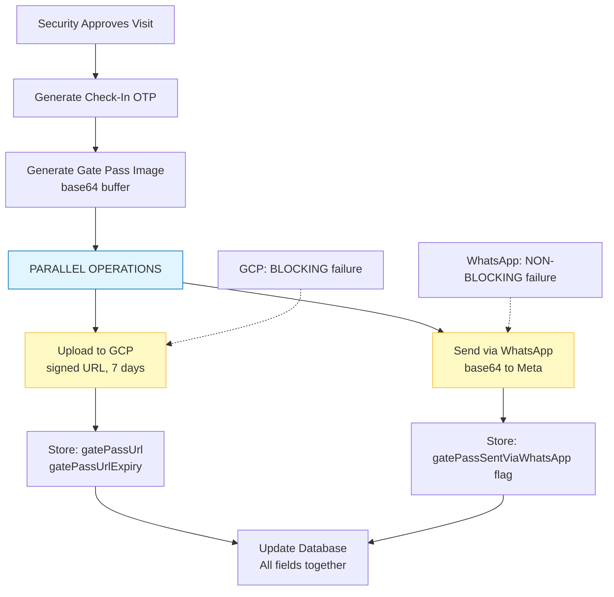
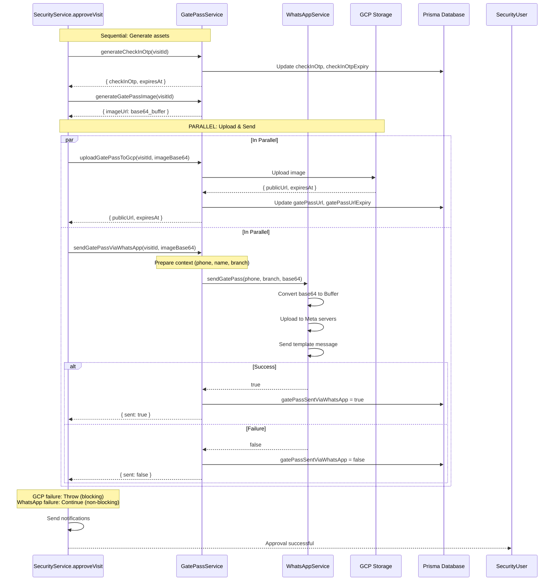

# WhatsApp Integration on Visit Approval - Technical Specification

> **Task ID:** 8.3
> **Feature:** Unified Visitor Workflow
> **Increment:** 8
> **Status:** Updated (Critical Changes: 2026-02-12)

## 1. File Path

- **Service:** `backend/src/visitors/services/gate-pass.service.ts` (extend)
- **Service:** `backend/src/security/security.service.ts` (modify: approveVisit method)
- **Service:** `backend/src/messaging/whatsapp.service.ts` (existing, use)
- **Error Codes:** `backend/src/visitors/constants/visitor-error-codes.enum.ts` (extend if needed)

## 2. Dependencies

| Service/Library | Purpose |
|----------------|---------|
| `WhatsAppService` | Send gate pass images via WhatsApp template messages |
| `GatePassService.generateCheckInOtp` | Generate 6-digit OTP for visit (existing from Increment 1) |
| `GatePassService.generateGatePassImage` | Generate gate pass image base64 (Task 8.1) |
| `GatePassService.uploadGatePassToGcp` | Upload gate pass image to GCP, get public URL (Task 8.2) |
| `Prisma` | Update Visit.gatePassSentViaWhatsApp flag |
| `ConfigService` | Access TEST_MODE configuration |

## 3. Data Models

### 3.1 Input Interface: WhatsAppDeliveryRequest

```typescript
export interface WhatsAppDeliveryRequest {
  visitId: string;
  gatePassBase64: string;  // CHANGED: Base64 PNG from Task 8.1, NOT GCP URL
}
```

### 3.2 Output Interface: WhatsAppDeliveryResponse

```typescript
export interface WhatsAppDeliveryResponse {
  sent: boolean;        // true if WhatsApp message sent successfully
  message: string;      // Success or error message for logging
}
```

### 3.3 Internal Interface: WhatsAppDeliveryContext

```typescript
export interface WhatsAppDeliveryContext {
  visitId: string;
  visitorPhone: string;
  visitorName: string;
  branchName: string;
  gatePassBase64: string;  // Direct input from parameter, NOT from database
}
```

### 3.4 Internal Interface: WhatsAppDeliveryResult

```typescript
export interface WhatsAppDeliveryResult {
  success: boolean;
  error?: string;
}
```

## 4. Function Signatures

### 4.1 Public Service Method: sendGatePassViaWhatsApp

```typescript
/**
 * Sends gate pass to visitor via WhatsApp template message.
 * Integrates with WhatsAppService to deliver gate pass image on visit approval.
 * Updates Visit.gatePassSentViaWhatsApp flag based on delivery status.
 *
 * @param visitId - UUID of the visit
 * @param gatePassBase64 - Base64 PNG image buffer from Task 8.1 (NOT GCP URL!)
 * @returns Delivery status and message
 *
 * @remarks
 * - Never throws: WhatsApp failures are logged and handled gracefully
 * - Visit approval continues even if WhatsApp delivery fails
 * - Database flag reflects actual delivery status
 * - WhatsApp upload is INDEPENDENT of GCP storage
 */
async sendGatePassViaWhatsApp(
  visitId: string,
  gatePassBase64: string  // CHANGED from gcpImageUrl
): Promise<WhatsAppDeliveryResponse>
```

### 4.2 Private Helper: Prepare WhatsApp Delivery Context

```typescript
/**
 * Retrieves and formats data needed for WhatsApp delivery.
 * Includes visitor phone, name, and branch name.
 * Uses gatePassBase64 parameter directly (pass-through).
 *
 * @param visitId - UUID of the visit
 * @returns Formatted context for WhatsAppService.sendGatePass
 *
 * @throws NotFoundException - If visit not found or required data missing
 */
private async prepareWhatsAppDeliveryContext(
  visitId: string
): Promise<WhatsAppDeliveryContext>
```

### 4.3 Private Helper: Execute WhatsApp Delivery

```typescript
/**
 * Executes the actual WhatsApp delivery using WhatsAppService.sendGatePass.
 * Handles TEST_MODE and normal delivery paths.
 *
 * @param context - WhatsApp delivery context with all required data
 * @returns Delivery result (success/error)
 *
 * @remarks
 * - Never throws: returns result object with success flag
 * - All errors are caught and logged
 */
private async executeWhatsAppDelivery(
  context: WhatsAppDeliveryContext
): Promise<WhatsAppDeliveryResult>
```

### 4.4 Private Helper: Update Delivery Flag

```typescript
/**
 * Updates the Visit.gatePassSentViaWhatsApp flag in the database.
 *
 * @param visitId - UUID of the visit
 * @param sent - Delivery status to set
 *
 * @remarks
 * - Logs but does not throw on database update failures
 * - Approval flow should continue even if flag update fails
 */
private async updateDeliveryFlag(
  visitId: string,
  sent: boolean
): Promise<void>
```

## 5. Pseudo-Code / Logic

### 5.1 Main Method: sendGatePassViaWhatsApp

```typescript
async sendGatePassViaWhatsApp(
  visitId: string,
  gatePassBase64: string  // CHANGED: Base64, NOT URL
): Promise<WhatsAppDeliveryResponse> {
  // 1. Validate inputs
  if (!visitId || typeof visitId !== 'string') {
    throw new BadRequestException('visitId is required');
  }
  if (!gatePassBase64 || typeof gatePassBase64 !== 'string') {
    throw new BadRequestException('gatePassBase64 is required');
  }

  // 2. Prepare delivery context (fetches visitor phone, name, branch)
  let context: WhatsAppDeliveryContext;
  try {
    context = await this.prepareWhatsAppDeliveryContext(visitId);
  } catch (error) {
    const errorMessage = error instanceof Error ? error.message : 'Unknown error';
    this.logger.error(`Failed to prepare WhatsApp context for ${visitId}: ${errorMessage}`);
    return { sent: false, message: `Failed to prepare delivery: ${errorMessage}` };
  }

  // 3. Inject base64 parameter into context
  context.gatePassBase64 = gatePassBase64;

  // 4. Execute WhatsApp delivery
  const result = await this.executeWhatsAppDelivery(context);

  // 5. Update database flag based on result
  try {
    await this.updateDeliveryFlag(visitId, result.success);
  } catch (error) {
    const errorMessage = error instanceof Error ? error.message : 'Unknown error';
    this.logger.error(`Failed to update delivery flag for ${visitId}: ${errorMessage}`);
    // Continue even if flag update fails
  }

  // 6. Return response
  if (result.success) {
    this.logger.log(`Gate pass sent via WhatsApp for visit ${visitId}`);
    return { sent: true, message: 'Gate pass sent successfully via WhatsApp' };
  } else {
    this.logger.warn(`Gate pass WhatsApp delivery failed for visit ${visitId}: ${result.error}`);
    return {
      sent: false,
      message: `WhatsApp delivery failed: ${result.error || 'Unknown error'}`
    };
  }
}
```

### 5.2 Helper: prepareWhatsAppDeliveryContext

```typescript
private async prepareWhatsAppDeliveryContext(
  visitId: string
): Promise<WhatsAppDeliveryContext> {
  // Query visit with visitor and branch relations
  const visit = await this.prisma.visit.findUnique({
    where: { id: visitId },
    include: { visitor: true, branch: true },
  });

  // Validate required data
  if (!visit) throw new NotFoundException(`Visit not found: ${visitId}`);
  if (!visit.visitor.phone) throw new BadRequestException(`Visitor phone not found`);
  if (!visit.branch.name) throw new BadRequestException(`Branch name not found`);
  // REMOVED: visit.visitQRCode validation - not needed for WhatsApp!

  // Format visitor name and return context
  const visitorName = `${visit.visitor.firstName}${
    visit.visitor.middleName ? ` ${visit.visitor.middleName}` : ''
  } ${visit.visitor.lastName}`.trim();

  return {
    visitId,
    visitorPhone: visit.visitor.phone,
    visitorName,
    branchName: visit.branch.name,
    gatePassBase64: '',  // Will be set by caller
  };
}
```

### 5.3 Helper: executeWhatsAppDelivery

```typescript
private async executeWhatsAppDelivery(
  context: WhatsAppDeliveryContext
): Promise<WhatsAppDeliveryResult> {
  try {
    // Pass base64 directly to WhatsAppService
    const sent = await this.whatsappService.sendGatePass(
      context.visitorPhone,
      context.branchName,
      context.gatePassBase64  // CHANGED: Direct parameter, NOT from database
    );

    return sent
      ? { success: true }
      : { success: false, error: 'WhatsAppService returned false' };
  } catch (error) {
    const errorMessage = error instanceof Error ? error.message : 'Unknown error';
    this.logger.error(`WhatsApp delivery exception for visit ${context.visitId}: ${errorMessage}`);
    return { success: false, error: errorMessage };
  }
}
```

### 5.4 Helper: updateDeliveryFlag

```typescript
private async updateDeliveryFlag(
  visitId: string,
  sent: boolean
): Promise<void> {
  try {
    await this.prisma.visit.update({
      where: { id: visitId },
      data: { gatePassSentViaWhatsApp: sent },
    });
  } catch (error) {
    const errorMessage = error instanceof Error ? error.message : 'Unknown error';
    this.logger.error(`Failed to update gatePassSentViaWhatsApp flag: ${errorMessage}`);
    throw error;
  }
}
```

### 5.5 Integration: SecurityService.approveVisit

**Integration Point:** In `SecurityService.approveVisit`. WhatsApp and GCP upload now run in PARALLEL using Promise.allSettled.

**When to Call:** After OTP generation succeeds and gate pass image is generated (ONCE).

**Key Change:** WhatsApp delivery is INDEPENDENT of GCP upload status. GCP failure is blocking, WhatsApp failure is non-blocking.

**Parallel Execution Flow:**
```typescript
async approveVisit(visitId: string) {
  // 1. Generate Check-In OTP
  await this.gatePassService.generateCheckInOtp(visitId);

  // 2. Generate gate pass image (base64) - ONCE
  const { imageUrl: imageBase64 } = await this.gatePassService.generateGatePassImage(visitId);

  // 3. Run both operations in parallel (non-blocking)
  const [gcpResult, whatsappResult] = await Promise.allSettled([
    this.gatePassService.uploadGatePassToGcp(visitId, imageBase64),
    this.gatePassService.sendGatePassViaWhatsApp(visitId, imageBase64)
  ]);

  // 4. Handle GCP result (BLOCKING)
  if (gcpResult.status === 'rejected') {
    throw new InternalServerErrorException(
      `Failed to upload gate pass to GCP: ${gcpResult.reason}`
    );
  }
  const gcpResponse = gcpResult.status === 'fulfilled' ? gcpResult.value : null;

  // 5. Handle WhatsApp result (NON-BLOCKING)
  if (whatsappResult.status === 'rejected') {
    this.logger.error(`WhatsApp delivery failed (non-blocking): ${whatsappResult.reason}`);
  }
  // WhatsApp flag is already updated by sendGatePassViaWhatsApp

  // 6. Continue with notifications
  await this.sendApprovalNotifications(visitId, gcpResponse.publicUrl);

  return { success: true };
}
```

## 6. Integration Flow Diagram



## 7. Test Cases

### 7.1 Happy Path

| Test Case | Expected Result |
|-----------|-----------------|
| Valid Approval with base64 | sent=true, gatePassSentViaWhatsApp=true |
| TEST_MODE Enabled | sent=true (mocked), flag=true |
| Meeting/Delivery Visit | WhatsApp sent with branch name and gate pass image |
| Base64 with data URI prefix | Handles data:image/png;base64,... format |
| Base64 without prefix | Handles raw base64 format |

### 7.2 Error Cases - Graceful Fallback

| Test Case | Expected Result |
|-----------|-----------------|
| WhatsApp API Failure | sent=false, flag=false, approval continues |
| Invalid Phone | sent=false, flag=false, approval continues |
| Network Timeout | sent=false, flag=false, approval continues |
| Template Not Found | sent=false, flag=false, approval continues |
| Meta Server Error | sent=false, flag=false, approval continues |

### 7.3 Error Cases - Missing Required Data

| Test Case | Expected Result |
|-----------|-----------------|
| Visit Not Found | sent=false with error message |
| Visitor Phone Missing | sent=false with error message |
| Branch Name Missing | sent=false with error message |
| Invalid visitId Type | throw BadRequestException |
| Invalid gatePassBase64 Type | throw BadRequestException |
| Empty gatePassBase64 | throw BadRequestException |

### 7.4 Database Flag Updates

| Test Case | Expected Result |
|-----------|-----------------|
| Successful Delivery | gatePassSentViaWhatsApp=true |
| Failed Delivery | gatePassSentViaWhatsApp=false |
| DB Update Fails | Logs error, continues, returns sent status |

### 7.5 Parallel Operation Tests (NEW)

| Test Case | Expected Result |
|-----------|-----------------|
| GCP success + WhatsApp success | Approval succeeds, both flags true |
| GCP success + WhatsApp failure | Approval succeeds, only WhatsApp flag false |
| GCP failure + WhatsApp success | Approval fails (GCP blocking), WhatsApp flag true |
| GCP failure + WhatsApp failure | Approval fails, WhatsApp flag false |

### 7.6 Base64 Validation Tests (NEW)

| Test Case | Expected Result |
|-----------|-----------------|
| Valid base64 PNG | Sent to WhatsAppService |
| Invalid base64 string | sent=false, error logged |
| Empty base64 | sent=false, error logged |
| Base64 too large (>5MB) | sent=false, error logged |
| Base64 with data URI prefix | Parsed correctly |

### 7.7 TEST_MODE Behavior

| Test Case | Expected Result |
|-----------|-----------------|
| TEST_MODE Delivery | Mocked true, flag=true |
| TEST_MODE with Invalid Phone | Mocked true, flag=true |
| TEST_MODE with Invalid Base64 | Mocked true, flag=true |

### 7.8 Integration Tests

| Test Case | Expected Result |
|-----------|-----------------|
| Full Approval Flow | Approved, OTP generated, GCP URL, WhatsApp sent |
| WhatsApp Failure | Approved, OTP generated, GCP URL, flag=false |
| GCP Failure | Approval fails (GCP blocking), no WhatsApp attempt |
| Both Failures | Approval fails, flag=false |

## 8. Error Handling

- **Input Validation:** Throw `BadRequestException` for invalid `visitId` or `gatePassBase64`
- **Context Preparation:** Throw `NotFoundException` for missing visit, `BadRequestException` for missing phone/branch. Main method catches and returns `{ sent: false, message }`
- **WhatsApp Delivery:** Never throws, always returns `WhatsAppDeliveryResult`. Catches exceptions, logs, returns `{ success: false, error }`
- **Database Flag:** Logs errors, doesn't throw from main method. Failures are non-critical
- **SecurityService Integration:** Use `Promise.allSettled` for parallel execution. GCP rejection throws, WhatsApp rejection logs and continues

## 9. Acceptance Criteria

- [ ] Accepts `gatePassBase64` parameter (NOT `gcpImageUrl`)
- [ ] Passes base64 image buffer directly to `WhatsAppService.sendGatePass(phone, branchName, base64)`
- [ ] Updates `gatePassSentViaWhatsApp` flag based on delivery status
- [ ] Works independently of GCP upload status (no dependency)
- [ ] Never throws for WhatsApp failures; logs all errors with context
- [ ] Graceful fallback: approval continues even if WhatsApp fails
- [ ] Validates base64 image format (not URL format)
- [ ] Works in TEST_MODE: returns true when enabled
- [ ] Integrates into `SecurityService.approveVisit` method
- [ ] Runs in parallel with GCP upload (Promise.allSettled)
- [ ] Approval does not fail if WhatsApp delivery fails
- [ ] GCP upload failure is still blocking (approval cannot complete)

## 10. Integration Notes

### 10.1 Preceding Tasks
- **Task 1.5:** `generateCheckInOtp` (existing)
- **Task 8.1:** `generateGatePassImage` - base64 image
- **Task 8.2:** `uploadGatePassToGcp` - public URL (independent, runs in parallel)

### 10.2 Integration Point
**SecurityService.approveVisit** - triggers WhatsApp delivery in parallel with GCP upload, using the same base64 image buffer.

### 10.3 Related Services
- `WhatsAppService.sendGatePass` - Sends template with base64 image (existing, tested)
- `GatePassService` - Extended with new methods
- `Prisma Visit.update` - Updates flag

### 10.4 Database Schema

```typescript
model Visit {
  // ... existing fields
  checkInOtp              String?
  checkInOtpExpiry        DateTime?
  gatePassSentViaWhatsApp Boolean @default(false)
  // Note: gatePassUrl, gatePassUrlExpiry added in Task 8.2
}
```

## 11. Performance Considerations

- Parallel execution with `Promise.allSettled`: GCP and WhatsApp run simultaneously
- Non-blocking async delivery, no approval response delay
- WhatsAppService handles timeouts internally
- No retry (Meta API limitation)
- Single UPDATE query for flag
- Base64 buffer reused: generated once, passed to both GCP and WhatsApp

## 12. Security Considerations

- Internal service; callers enforce authorization
- Phone numbers normalized (E.164)
- Images contain name and OTP (access document)
- No sensitive data sent
- Database flag tracks delivery status
- Base64 buffer is transient (uploaded to Meta, not stored permanently)

## 13. Configuration

| Variable | Description | Default |
|----------|-------------|---------|
| `TEST_MODE` | Enable mock behavior | "false" |
| `WHATSAPP_API_URL` | Meta API URL | - |
| `WHATSAPP_PHONE_NUMBER_ID` | Phone number ID | - |
| `WHATSAPP_ACCESS_TOKEN` | Access token | - |
| `WHATSAPP_TEMPLATE_GATE_PASS` | Template name | "gate_pass_approved" |

**TEST_MODE:** Mock returns true, no actual message sent, logs action.

## 14. Workflow Sequence



## 15. Known Limitations

- No retry on WhatsApp failure (Meta API rate limits)
- Phone validation relies on `WhatsAppService.normalizePhone`
- Requires "gate_pass_approved" template approved in Meta Business Suite
- Visitors must have opted in (error code 131047)
- Best effort delivery - no guarantee even if API returns true
- Base64 buffer limited to 5MB (Meta API constraint)
- No dependency between GCP and WhatsApp delivery (independent failures)

## 16. Future Enhancements (Out of Scope)

- Background job queue for retrying failed deliveries
- Meta webhooks for delivery receipts
- Multi-language template support
- SMS fallback for WhatsApp failures
- Delivery rate and engagement analytics
- Image compression before WhatsApp upload
- Queue-based delivery system with retry logic

## 17. Revision History

| Date | Author | Changes |
|------|--------|---------|
| 2026-02-12 | Tech Lead | **CRITICAL UPDATE**: Changed input from `gcpImageUrl` to `gatePassBase64`. WhatsAppService uses base64, not URLs. Made WhatsApp delivery independent and parallel with GCP upload. Updated all interfaces, test cases, and integration flow. |
