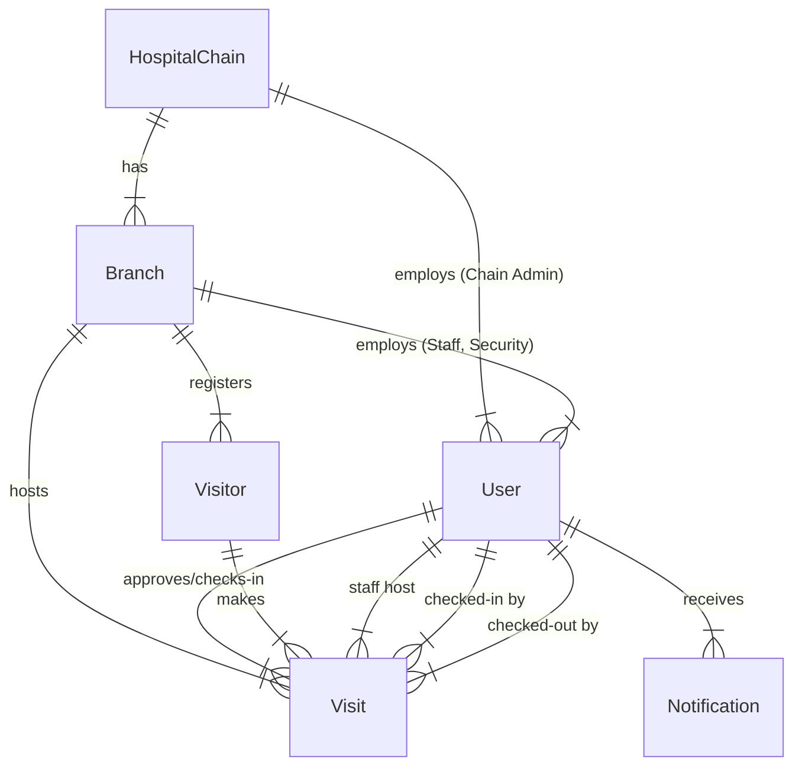

# Data Schema & Database Models

## 1. Overview
The system uses **MySQL** as the primary relational database, managed via **Prisma ORM**. The schema is designed to support a multi-tenant-like structure where data is hierarchically scoped by `HospitalChain` and `Branch`.

## 2. Entity Relationship Diagram (ERD)

## 3. Core Models

### 3.1 Hierarchy Models

- **HospitalChain**
  - Top-level entity.
  - Contains global details (Name, HQ Address).
  - Parent to multiple `Branches`.

- **Branch**
  - Physical location of a hospital.
  - Linked to one `HospitalChain`.
  - Scopes `Users` (Staff/Security) and `Visits`.
  - Contains a unique `qrCode` for visitor self-registration.

### 3.2 User Management

- **User**
  - Represents all system actors (Admins, Staff, Security).
  - **Discriminator:** `Role` enum (SUPER_ADMIN, CHAIN_ADMIN, BRANCH_ADMIN, STAFF, SECURITY, etc.).
  - **Scoped Access:**
    - `hospitalChainId`: Nullable (Required for Chain Admin & below).
    - `branchId`: Nullable (Required for Branch Admin & below).

### 3.3 Visitor Management

- **Visitor**
  - Represents a physical person.
  - **Uniqueness:** Unique constraint on `[phone, branchId]`. A visitor is registered per branch.
  - Stores PII: Name, Phone, Photo, ID Documents.

- **Visit**
  - Represents a single entry event.
  - **Status Workflow:** `REQUEST_SENT` -> `APPROVED` -> `CHECKED_IN` -> `CHECKED_OUT`.
  - Links `Visitor` to a `Staff` member (host).
  - Tracks timestamps (`checkInTime`, `checkOutTime`) and duration.

## 4. Key Enums

- **Role:** Defines permission levels.
- **UserType:** Granular job title (Doctor, Nurse, Receptionist).
- **Department:** Medical/Admin departments (Cardiology, HR).
- **VisitStatus:** State machine for visits.
- **VisitCategory:** `MEETING` vs `DELIVERY`.

## 5. Data Consistency & Integrity
- **Foreign Keys:** Enforced by MySQL.
- **Soft Deletes:** `User` model has `isActive` flag; physical deletion is restricted for audit trails.
- **Transactions:** Critical flows (e.g., Check-in) should use Prisma transactions to ensure atomicity.
