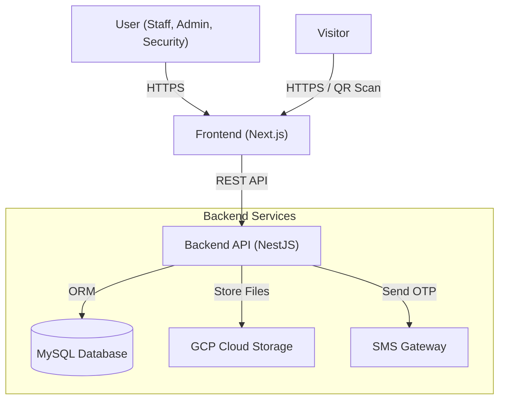

# High-Level Design (HLD)

## 1. System Overview

The **Hospital Visitor Tracking System** is a comprehensive solution designed to manage and track visitors across multiple hospital chains and branches. It facilitates secure visitor registration, check-in/check-out workflows, and role-based access control for hospital staff and administrators.

The system follows a **Monolithic Architecture** within a Monorepo structure, utilizing **NestJS** for the backend and **Next.js** for the frontend.

## 2. Architecture Diagram (C4 Context)

## 3. Component Description

### 3.1 Frontend (Client Layer)
- **Framework:** Next.js 15 (App Router)
- **Language:** TypeScript
- **Styling:** Tailwind CSS, ShadCN UI
- **State Management:** React Context, TanStack Query
- **Responsibilities:**
  - Renders UI for different roles (Super Admin, Chain Admin, Branch Admin, Staff, Security).
  - Handles client-side validation (Zod).
  - Manages authentication state (JWT).
  - Generates and scans QR codes.

### 3.2 Backend (Application Layer)
- **Framework:** NestJS
- **Language:** TypeScript
- **Architecture:** Modular (Module-Controller-Service pattern)
- **Responsibilities:**
  - Exposes RESTful API endpoints.
  - Enforces Business Logic and RBAC (Role-Based Access Control).
  - Manages Data Consistency.
  - Handles File Uploads to GCP.
  - Generates OTPs for authentication.

### 3.3 Data Layer
- **Database:** MySQL
- **ORM:** Prisma
- **Responsibilities:**
  - Persists relational data (Users, Chains, Branches, Visits).
  - Enforces referential integrity.

### 3.4 External Services
- **GCP Storage:** Stores visitor photos and ID documents.
- **SMS Gateway:** Delivers OTPs for login and notifications.

## 4. Key Workflows

### 4.1 Authentication
1. User enters phone number.
2. Backend generates OTP and sends via SMS.
3. User enters OTP.
4. Backend verifies OTP and issues JWT.

### 4.2 Visitor Check-In
1. Security/Visitor initiates request.
2. Visit record created with status `REQUEST_SENT`.
3. Staff/Security approves request -> Status `APPROVED`.
4. Visitor arrives -> Security checks in -> Status `CHECKED_IN`.
5. Visitor leaves -> Security checks out -> Status `CHECKED_OUT`.

## 5. Deployment Architecture
- **Containerization:** Docker (Dockerfiles present for both ends).
- **Orchestration:** Docker Compose (for local dev/simple deploy).
- **Infrastructure:** Likely VM-based deployment (referenced in `docs/deployment/VM-deploy.md`).
