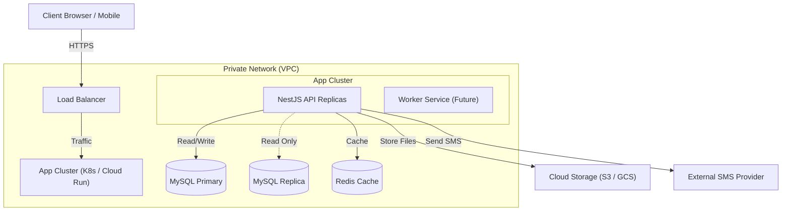

# Infrastructure Diagram

## 1. Cloud Infrastructure (Conceptual)

This diagram represents the recommended production infrastructure on a cloud provider (e.g., GCP/AWS), moving away from a single VM setup.

## 2. Current Deployment (VM Based)

As per `docs/deployment/VM-deploy.md`, the current setup is likely:

- **Single VM (e.g., EC2 / Compute Engine)**
  - Docker Compose running:
    - `backend` container
    - `frontend` container
    - `nginx` (Reverse Proxy)
  - **Database:** Managed SQL or containerized MySQL (Not recommended for Prod).

## 3. Network Security
- **Firewall Rules:**
  - Inbound: Allow 80/443 (HTTP/HTTPS) from Load Balancer/Public.
  - Outbound: Allow traffic to SMS Gateway and Cloud Storage.
  - Internal: Database only accepts connections from App Cluster.
